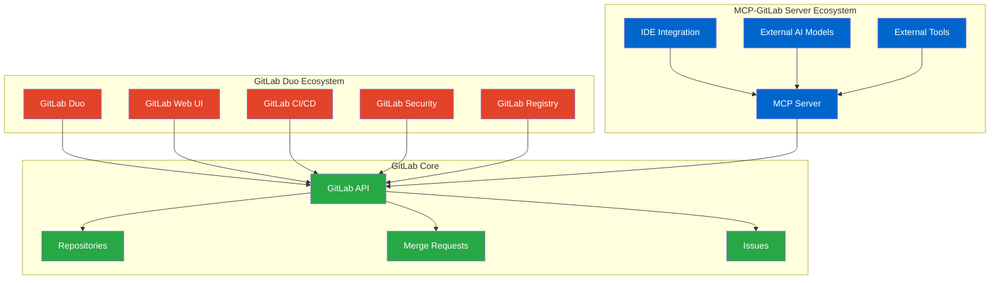
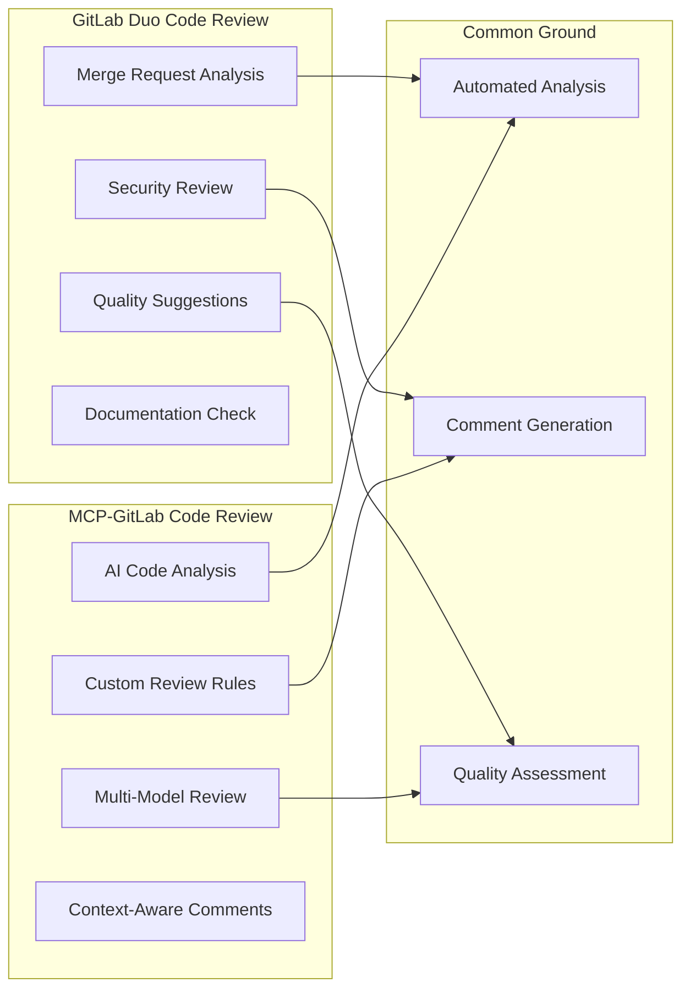
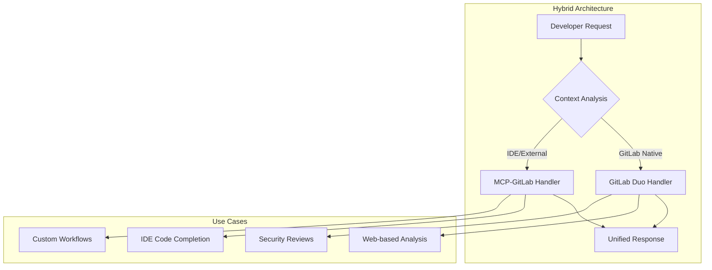
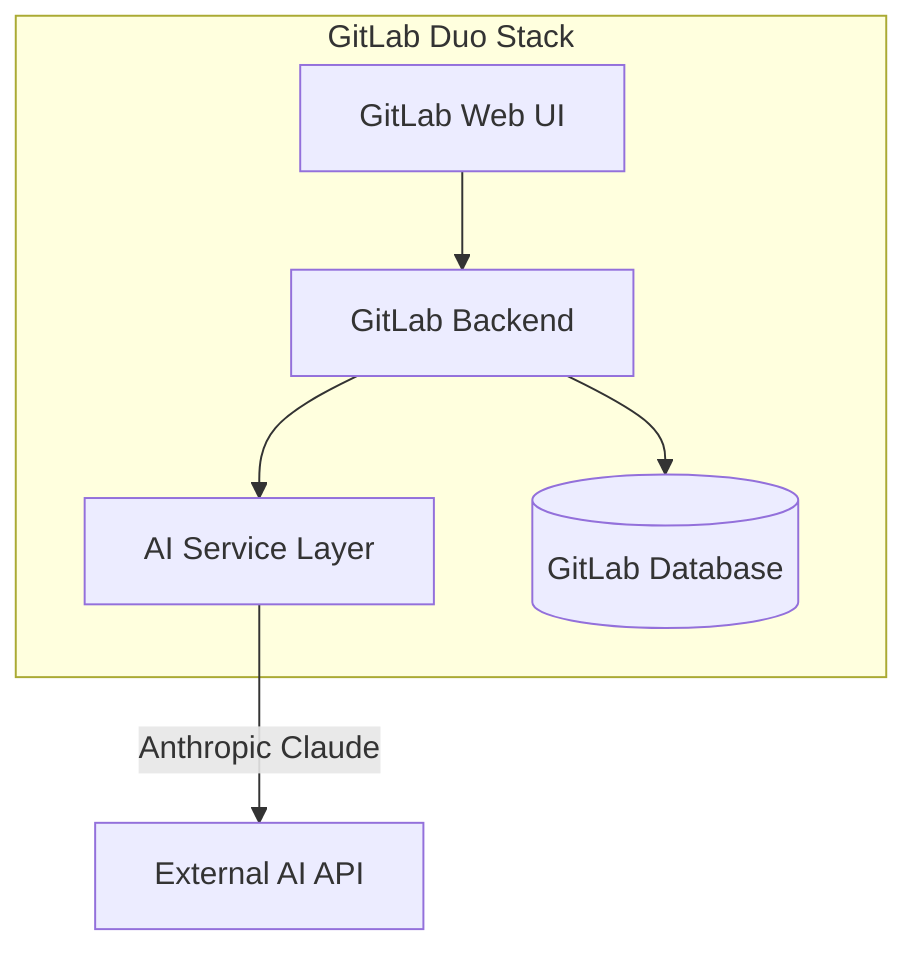
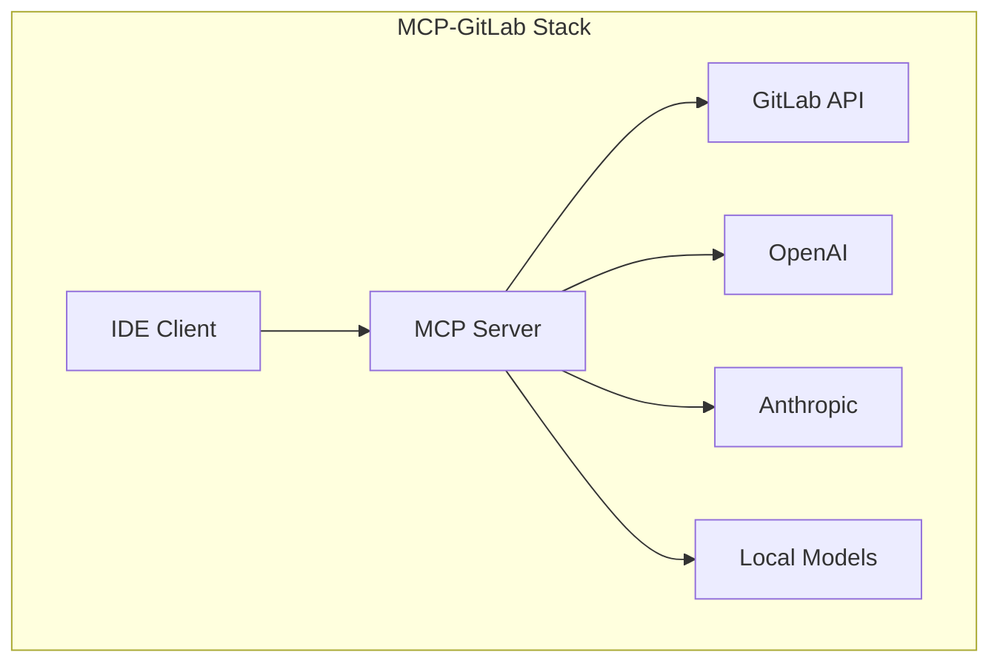

# GitLab Duo vs MCP-GitLab Server: Feature Overlap Analysis

## 🔍 Executive Summary

This document analyzes the overlap between GitLab Duo's native AI features and the MCP-GitLab server implementation, identifying areas of convergence, complementary capabilities, and strategic differentiation.

## 📊 Feature Comparison Matrix

### Core AI Capabilities

| Feature Category | GitLab Duo | MCP-GitLab Server | Overlap Level | Strategic Position |
|------------------|------------|-------------------|---------------|-------------------|
| **Code Generation** | ✅ Native | ✅ Via AI Models | 🟡 High | Complementary |
| **Code Completion** | ✅ Integrated | ✅ IDE-Based | 🟡 High | Alternative Approach |
| **Code Review** | ✅ MR Analysis | ✅ AI-Assisted | 🔴 Critical | Direct Competition |
| **Chat Interface** | ✅ GitLab UI | ✅ IDE Integration | 🟡 Medium | Different UX |
| **Issue Analysis** | ✅ Native | ✅ Via API | 🟡 Medium | Complementary |
| **Documentation** | ✅ Auto-gen | ✅ AI-Assisted | 🟡 Medium | Similar Goals |
| **Security Scanning** | ✅ Integrated | ❌ Limited | 🟢 Low | GitLab Advantage |
| **Pipeline Optimization** | ✅ Native | ❌ External | 🟢 Low | GitLab Advantage |

### Integration Capabilities



## 🎯 Detailed Feature Analysis

### 1. Code Generation & Completion

#### GitLab Duo Approach
```yaml
gitlab_duo_code_generation:
  integration: native_gitlab_ui
  models: 
    - anthropic_claude
    - custom_models
  features:
    - inline_suggestions
    - context_aware_completion
    - project_specific_training
  licensing: gitlab_premium_ultimate
```

#### MCP-GitLab Server Approach
```yaml
mcp_gitlab_code_generation:
  integration: ide_extensions
  models:
    - openai_gpt
    - anthropic_claude
    - local_models
  features:
    - real_time_assistance
    - multi_ide_support
    - custom_ai_providers
  licensing: open_source_flexible
```

**Overlap Assessment**: 🟡 **High Overlap**
- Both provide AI-powered code generation
- Different integration points (GitLab UI vs IDE)
- Both support major AI models
- MCP offers more flexibility in AI provider choice

### 2. Code Review Automation

#### Feature Comparison


**Overlap Assessment**: 🔴 **Critical Overlap**
- Direct competition in automated code review
- GitLab Duo: Integrated, premium features
- MCP-GitLab: Flexible, customizable, open-source

### 3. Chat and Conversational AI

#### GitLab Duo Chat
```typescript
interface GitLabDuoChat {
  context: 'project' | 'merge_request' | 'issue';
  capabilities: {
    codeExplanation: boolean;
    troubleshooting: boolean;
    projectInsights: boolean;
    securityGuidance: boolean;
  };
  integration: 'gitlab_ui';
  dataAccess: 'full_project_context';
}
```

#### MCP-GitLab Chat
```typescript
interface MCPGitLabChat {
  context: 'ide' | 'terminal' | 'external';
  capabilities: {
    codeGeneration: boolean;
    debugging: boolean;
    documentation: boolean;
    customWorkflows: boolean;
  };
  integration: 'ide_extensions' | 'cli_tools';
  dataAccess: 'api_limited';
}
```

**Overlap Assessment**: 🟡 **Medium Overlap**
- Different user interfaces and contexts
- Complementary rather than competing
- GitLab Duo: Project-centric, web-based
- MCP-GitLab: Development-centric, IDE-based

## 🔄 Strategic Positioning

### Competitive Advantages

#### GitLab Duo Strengths
```yaml
gitlab_duo_advantages:
  native_integration:
    - seamless_gitlab_experience
    - full_project_context
    - integrated_security_features
  
  enterprise_features:
    - premium_ai_models
    - advanced_analytics
    - compliance_features
  
  data_access:
    - complete_project_history
    - ci_cd_pipeline_insights
    - security_scan_results
```

#### MCP-GitLab Server Strengths
```yaml
mcp_gitlab_advantages:
  flexibility:
    - multiple_ai_providers
    - custom_model_integration
    - open_source_extensibility
  
  developer_experience:
    - ide_native_integration
    - real_time_assistance
    - cross_platform_support
  
  cost_effectiveness:
    - free_open_source
    - choose_your_ai_provider
    - no_vendor_lock_in
```

### 🤝 Collaboration Opportunities

#### Potential Integration Scenarios



## 📈 Market Positioning Analysis

### Target Audience Segmentation

| Segment | GitLab Duo | MCP-GitLab Server | Overlap |
|---------|------------|-------------------|---------|
| **Enterprise Teams** | 🎯 Primary | 🔄 Secondary | 30% |
| **Open Source Projects** | 💰 Paywall | 🎯 Primary | 70% |
| **Individual Developers** | 💰 Cost Barrier | 🎯 Primary | 60% |
| **GitLab Premium Users** | 🎯 Primary | 🔄 Complementary | 40% |
| **Multi-Platform Teams** | 🔄 Limited | 🎯 Primary | 80% |

### 💡 Differentiation Strategies

#### For GitLab Duo
```yaml
gitlab_duo_differentiation:
  focus_areas:
    - deep_gitlab_integration
    - enterprise_security
    - compliance_automation
    - pipeline_optimization
  
  unique_value:
    - single_pane_of_glass
    - enterprise_support
    - integrated_devops_ai
```

#### For MCP-GitLab Server
```yaml
mcp_gitlab_differentiation:
  focus_areas:
    - developer_productivity
    - ai_model_flexibility
    - ide_native_experience
    - open_source_ecosystem
  
  unique_value:
    - no_vendor_lock_in
    - customizable_ai_stack
    - community_driven
```

## 🛠️ Technical Implementation Comparison

### Architecture Patterns

#### GitLab Duo Architecture


#### MCP-GitLab Server Architecture


### Data Flow Comparison

#### GitLab Duo Data Flow
```yaml
gitlab_duo_flow:
  data_sources:
    - project_repositories
    - merge_request_history
    - ci_cd_pipeline_data
    - security_scan_results
    - user_activity_logs
  
  processing:
    - native_gitlab_processing
    - integrated_ai_inference
    - result_caching
  
  outputs:
    - web_ui_suggestions
    - automated_comments
    - security_insights
```

#### MCP-GitLab Server Data Flow
```yaml
mcp_gitlab_flow:
  data_sources:
    - gitlab_api_endpoints
    - ide_context
    - user_prompts
    - project_metadata
  
  processing:
    - mcp_protocol_handling
    - external_ai_inference
    - response_formatting
  
  outputs:
    - ide_suggestions
    - real_time_assistance
    - custom_workflows
```

## 📊 Performance and Scalability

### Resource Requirements

| Metric | GitLab Duo | MCP-GitLab Server | Comparison |
|--------|------------|-------------------|------------|
| **Memory Usage** | Integrated into GitLab | ~200-500MB standalone | MCP More Efficient |
| **CPU Requirements** | Part of GitLab instance | Low-moderate | MCP More Efficient |
| **Network Bandwidth** | Internal GitLab traffic | External API calls | GitLab More Efficient |
| **Storage** | GitLab database | Minimal local storage | MCP More Efficient |
| **Scalability** | Scales with GitLab | Horizontal scaling | Both Scalable |

## 🎯 Recommendations

### For Organizations

#### Choose GitLab Duo When:
- ✅ Heavy GitLab Premium/Ultimate users
- ✅ Need integrated security and compliance features  
- ✅ Prefer single-vendor support
- ✅ Require deep GitLab ecosystem integration
- ✅ Have budget for premium features

#### Choose MCP-GitLab Server When:
- ✅ Need flexible AI provider options
- ✅ Prefer open-source solutions
- ✅ Require IDE-native AI assistance
- ✅ Want customizable AI workflows
- ✅ Have budget constraints
- ✅ Use multiple development platforms

#### Hybrid Approach When:
- ✅ Large enterprise with diverse needs
- ✅ Different teams have different preferences
- ✅ Want best-of-both-worlds functionality
- ✅ Can manage multiple AI tools

### 🔮 Future Convergence Scenarios

#### Scenario 1: Integration Partnership
```yaml
integration_partnership:
  description: "GitLab partners with MCP-GitLab for IDE integration"
  benefits:
    - gitlab_duo_web_experience
    - mcp_gitlab_ide_experience
    - unified_ai_capabilities
  challenges:
    - licensing_complexity
    - feature_overlap_management
```

#### Scenario 2: Open Source Contribution
```yaml
open_source_contribution:
  description: "GitLab open-sources Duo capabilities"
  benefits:
    - community_innovation
    - increased_adoption
    - competitive_advantage
  challenges:
    - revenue_impact
    - support_overhead
```

#### Scenario 3: Market Segmentation
```yaml
market_segmentation:
  description: "Clear differentiation by use case and audience"
  gitlab_duo_focus: "Enterprise, integrated DevOps AI"
  mcp_gitlab_focus: "Developer productivity, AI flexibility"
  outcome: "Complementary market positions"
```

## 🔗 Related Documentation

- [GitLab Duo Official Documentation](https://docs.gitlab.com/ee/user/gitlab_duo/)
- [MCP-GitLab Server Architecture](../design/gitlab-mcp-server.md)
- [Implementation Comparison](../implementation/index.md)
- [Security Considerations](../security/security.md)
