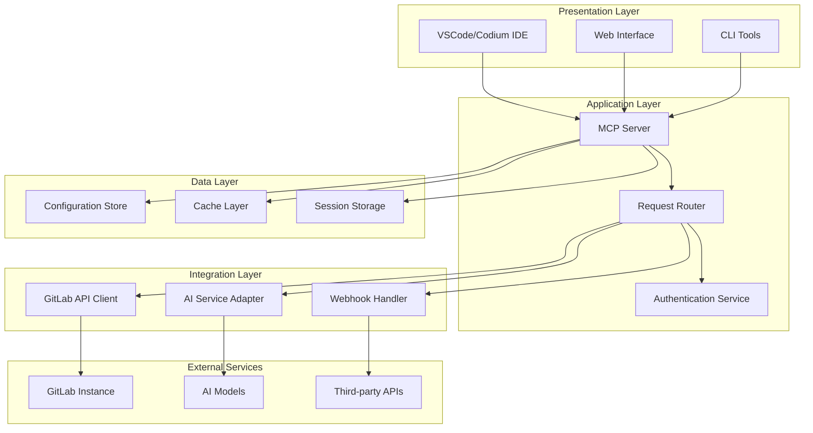
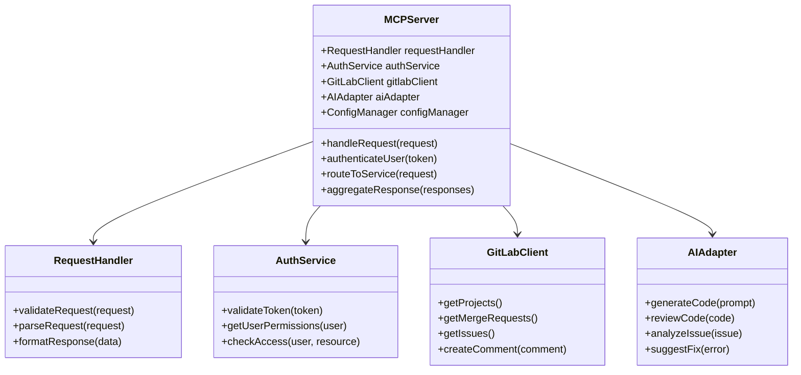
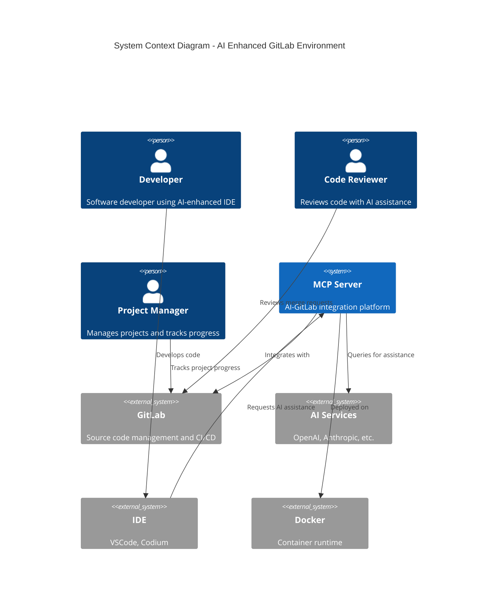
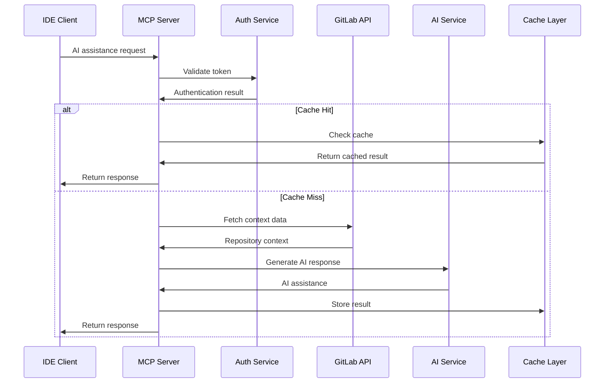
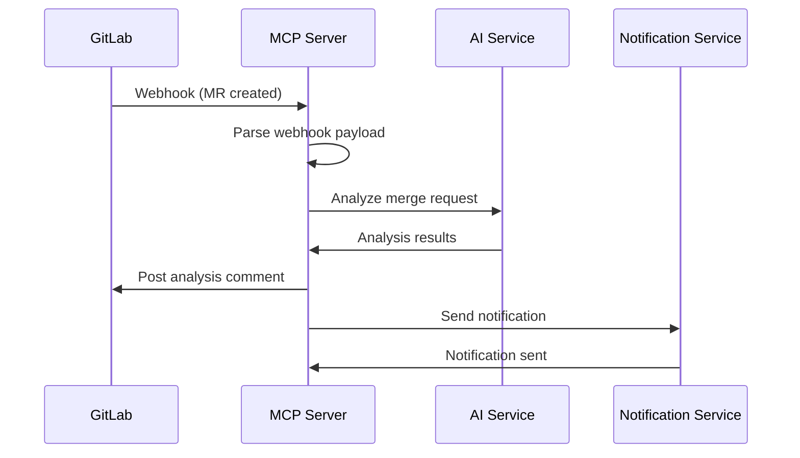
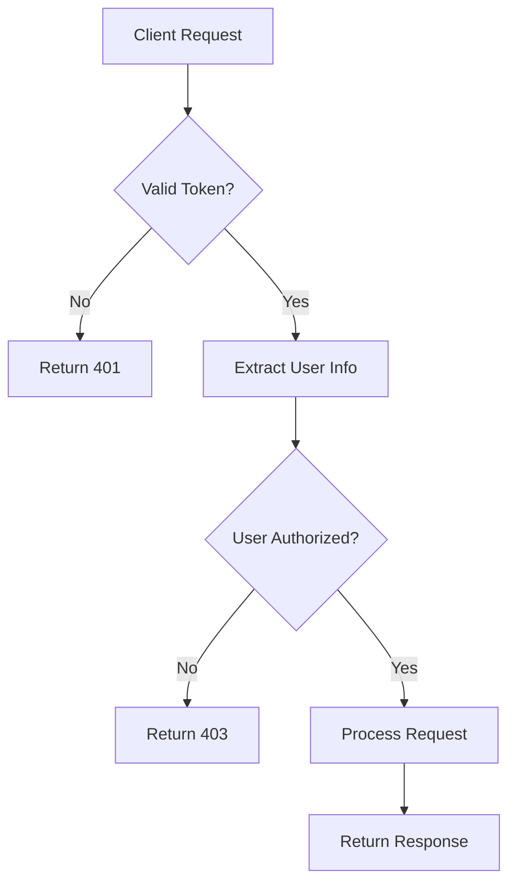
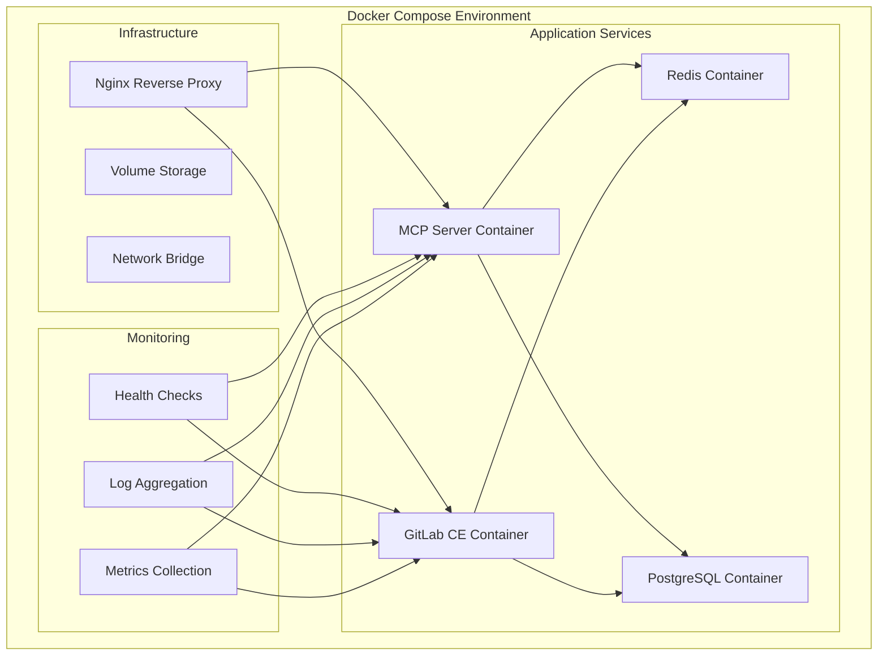
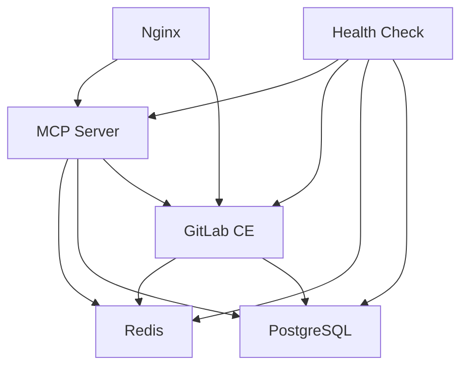

# Architecture Design

## 🏗️ System Architecture

This document provides a detailed architectural view of the AI-enhanced GitLab development environment, including component interactions, data flows, and system boundaries.

## 🔄 High-Level Architecture

The system follows a layered architecture pattern with clear separation of concerns:



## 🧩 Component Model

### Core Components

#### MCP Server
- **Purpose**: Central orchestration hub for AI-GitLab integration
- **Responsibilities**:
  - Request routing and validation
  - Authentication and authorization
  - Service coordination
  - Response aggregation



#### GitLab Integration
- **Purpose**: Interface with GitLab APIs and webhooks
- **Responsibilities**:
  - Project management operations
  - Merge request handling
  - Issue tracking integration
  - CI/CD pipeline interaction

#### AI Service Adapter
- **Purpose**: Abstract AI service interactions
- **Responsibilities**:
  - Model selection and routing
  - Prompt engineering and optimization
  - Response parsing and formatting
  - Error handling and fallbacks

## 🌐 System Context Diagram



## 📊 Data Flow Architecture

### Request Processing Flow



### Webhook Processing Flow



## 🔒 Security Architecture

### Authentication & Authorization



### Security Layers
1. **Transport Security**: TLS encryption for all communications
2. **Authentication**: JWT tokens and API keys
3. **Authorization**: Role-based access control (RBAC)
4. **Data Protection**: Encryption at rest and in transit
5. **Audit Logging**: Comprehensive activity tracking

## 🚀 Deployment Architecture

### Container Architecture



### Service Dependencies



## 📈 Scalability Considerations

### Horizontal Scaling

- **MCP Server**: Stateless design allows multiple instances
- **Load Balancing**: Nginx for request distribution
- **Database**: Read replicas for improved performance
- **Cache**: Redis cluster for distributed caching

### Performance Optimization

- **Connection Pooling**: Efficient database connections
- **Async Processing**: Non-blocking I/O operations
- **Caching Strategy**: Multi-layer caching approach
- **Resource Limits**: Container resource constraints

## 🔧 Configuration Management

### Environment-Based Configuration

```yaml
# Development Environment
environment: development
debug: true
log_level: debug

# Production Environment  
environment: production
debug: false
log_level: info
```

### Service Configuration

```yaml
mcp_server:
  host: 0.0.0.0
  port: 3000
  workers: 4
  
gitlab:
  url: "${GITLAB_URL}"
  token: "${GITLAB_TOKEN}"
  
ai_services:
  openai:
    api_key: "${OPENAI_API_KEY}"
    model: "gpt-4"
  anthropic:
    api_key: "${ANTHROPIC_API_KEY}"
    model: "claude-3"
```

## 🔗 Integration Patterns

### API Integration Pattern
- RESTful APIs for synchronous operations
- Webhooks for event-driven updates
- GraphQL for complex data queries

### Event-Driven Architecture
- Webhook-based event processing
- Asynchronous task queues
- Event sourcing for audit trails

### Circuit Breaker Pattern
- Fault tolerance for external services
- Graceful degradation
- Automatic recovery mechanisms

## 📋 Quality Attributes

### Reliability
- High availability through redundancy
- Fault tolerance mechanisms
- Data consistency guarantees

### Performance  
- Sub-second response times
- Efficient resource utilization
- Scalable architecture design

### Security
- Defense in depth strategy
- Regular security assessments
- Compliance with security standards

### Maintainability
- Modular component design
- Comprehensive documentation
- Automated testing coverage
