# Component Model Design

## 🧩 Overview

This document defines the component model for the AI-enhanced GitLab development environment, detailing the modular architecture, component responsibilities, and interaction patterns.

## 🏗️ Component Architecture

### Layered Architecture

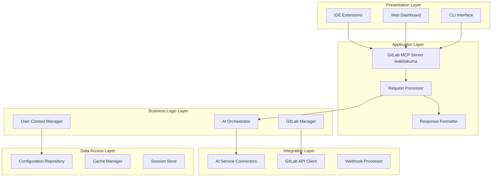

## 📦 Core Components

### 1. MCP Server Core

**Purpose**: Central coordination hub for all system operations

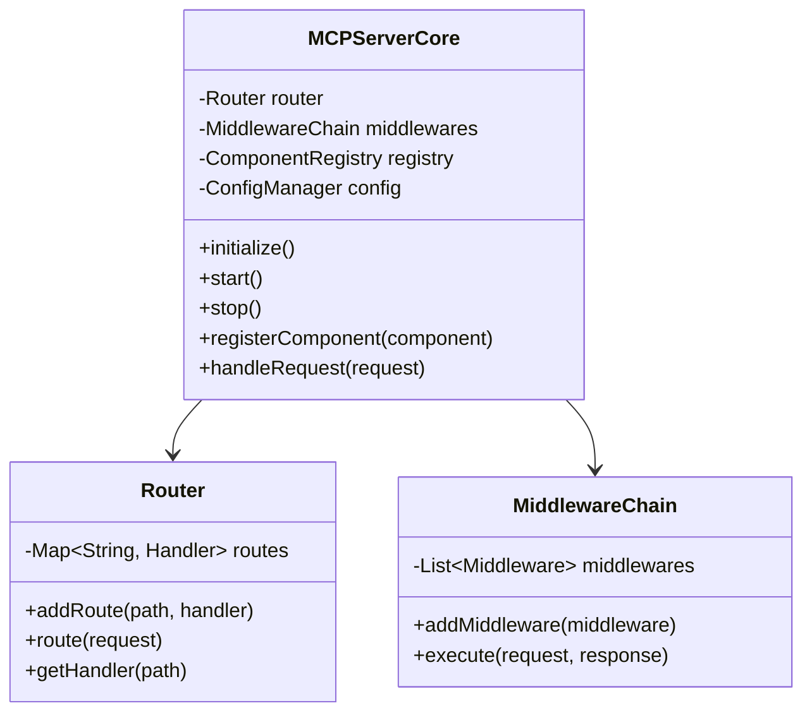

**Responsibilities**:
- Request routing and lifecycle management
- Component registration and dependency injection
- Configuration management
- Error handling and logging

### 2. AI Orchestrator

**Purpose**: Manages AI service interactions and prompt optimization

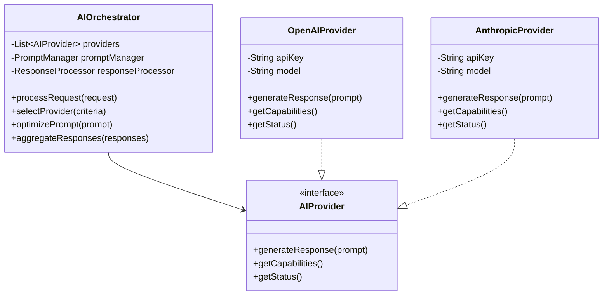

**Responsibilities**:
- AI service selection and load balancing
- Prompt engineering and optimization
- Response aggregation and formatting
- Fallback and error handling

### 3. GitLab Manager

**Purpose**: Handles all GitLab API interactions and data management

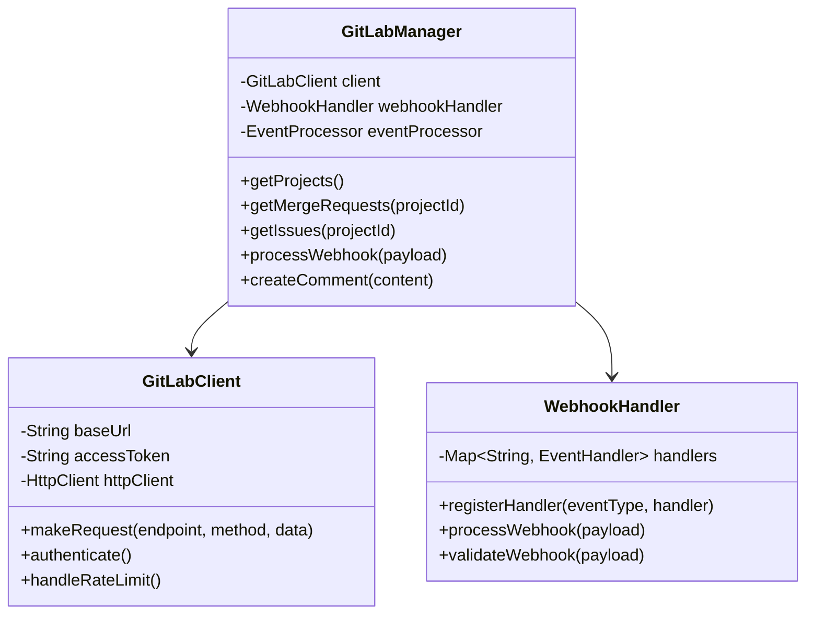

**Responsibilities**:
- GitLab API communication
- Webhook processing and event handling
- Data transformation and caching
- Rate limiting and error recovery

### 4. User Context Manager

**Purpose**: Manages user sessions, preferences, and contextual information

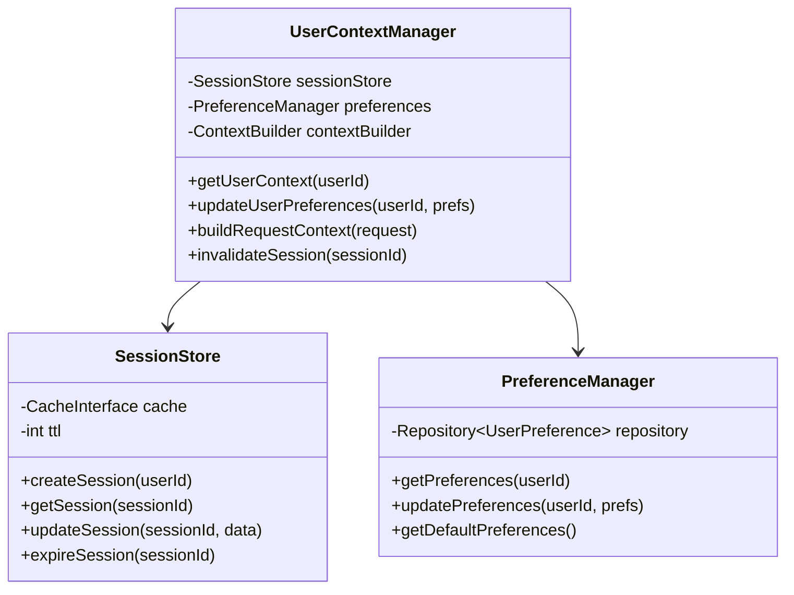

**Responsibilities**:
- User authentication and session management
- Preference storage and retrieval
- Context building for AI requests
- Permission and access control

## 🔌 Integration Components

### 1. AI Service Connectors

**Purpose**: Abstraction layer for different AI service providers

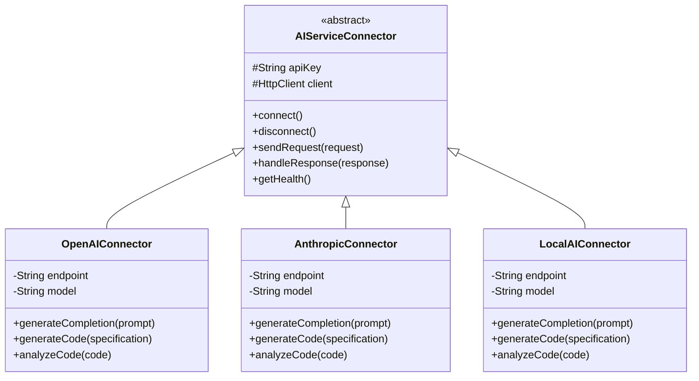

### 2. IDE Integration Components

**Purpose**: Handle communication with various IDE clients

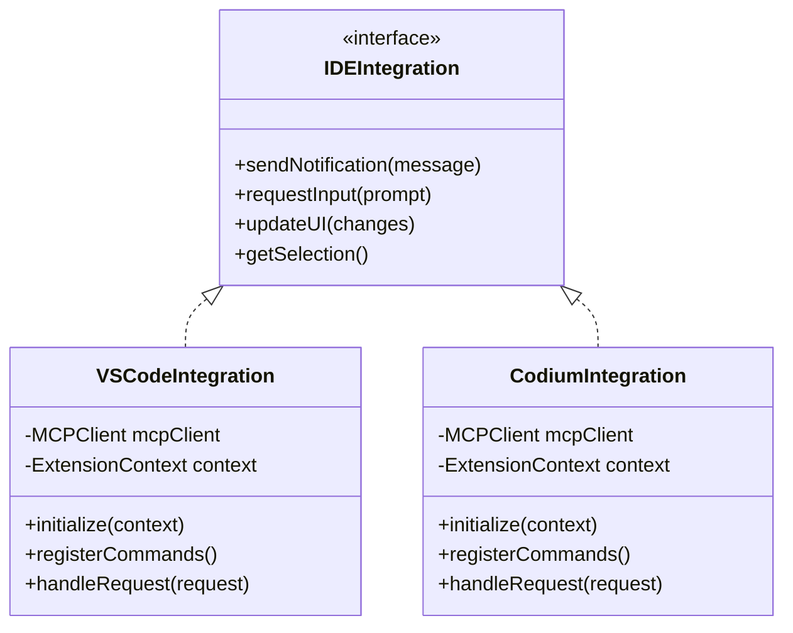

## 🗄️ Data Components

### 1. Configuration Repository

**Purpose**: Centralized configuration management

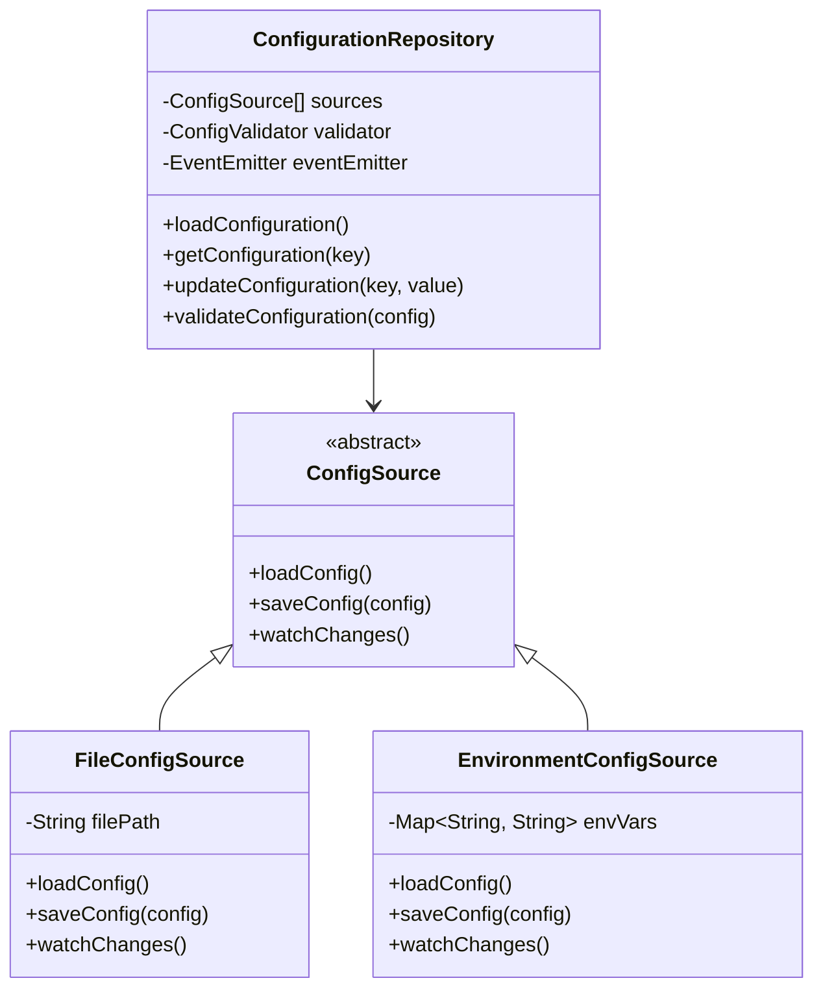

### 2. Cache Manager

**Purpose**: Intelligent caching for improved performance

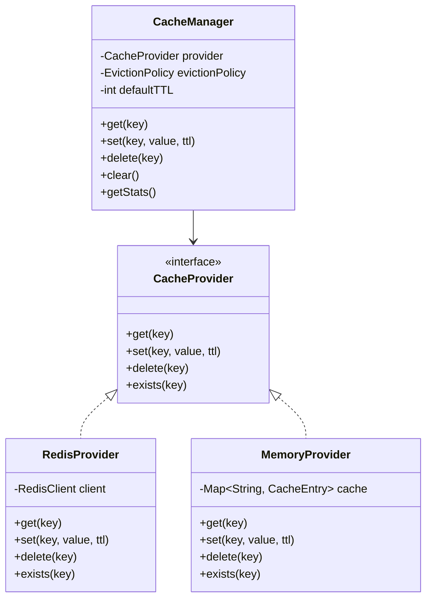

## 🔄 Component Interaction Patterns

### 1. Request Processing Pattern

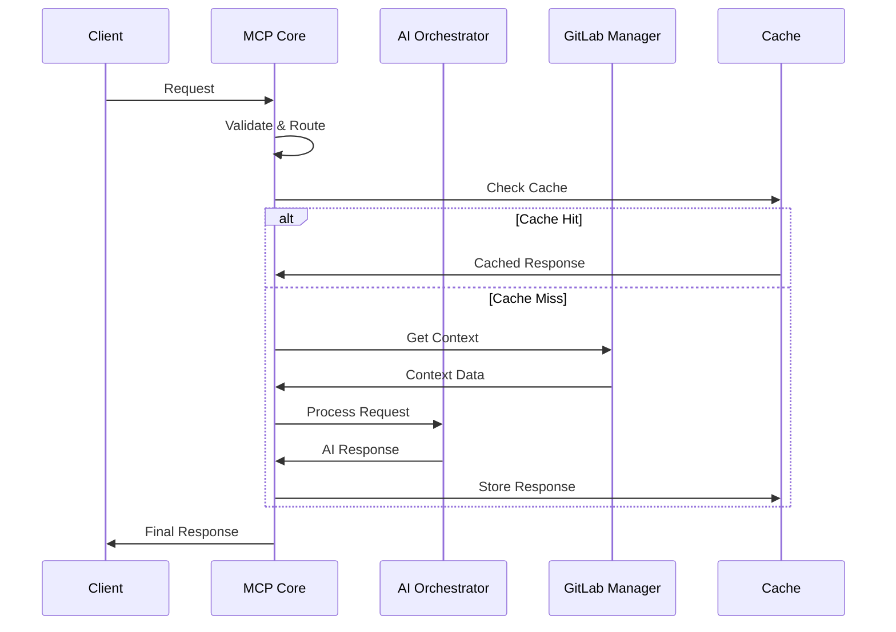

### 2. Event-Driven Pattern

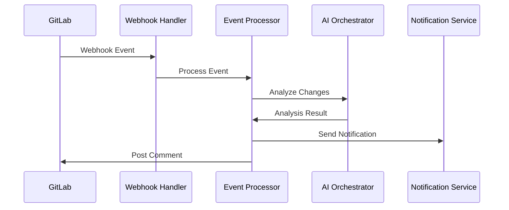

## 🧪 Component Testing Strategy

### Unit Testing

```yaml
component_tests:
  mcp_server_core:
    - test_request_routing
    - test_middleware_execution
    - test_component_registration
  
  ai_orchestrator:
    - test_provider_selection
    - test_prompt_optimization
    - test_response_aggregation
  
  gitlab_manager:
    - test_api_communication
    - test_webhook_processing
    - test_error_handling
```

### Integration Testing

```yaml
integration_tests:
  ai_gitlab_flow:
    - test_code_review_workflow
    - test_issue_analysis_flow
    - test_documentation_generation
  
  ide_integration:
    - test_vscode_communication
    - test_codium_communication
    - test_real_time_assistance
```

## 📊 Component Metrics

### Performance Metrics

```yaml
metrics:
  request_processing:
    - request_duration
    - request_throughput
    - error_rate
  
  ai_orchestrator:
    - provider_response_time
    - prompt_optimization_time
    - success_rate
  
  gitlab_manager:
    - api_response_time
    - webhook_processing_time
    - rate_limit_hits
```

### Health Metrics

```yaml
health_checks:
  components:
    - mcp_server_status
    - ai_provider_availability
    - gitlab_connectivity
    - cache_availability
  
  thresholds:
    response_time: 500ms
    error_rate: 1%
    availability: 99.9%
```

## 🔧 Component Configuration

### Component Registry

```yaml
components:
  mcp_server_core:
    class: MCPServerCore
    singleton: true
    dependencies:
      - router
      - middleware_chain
  
  ai_orchestrator:
    class: AIOrchestrator
    dependencies:
      - ai_providers
      - prompt_manager
  
  gitlab_manager:
    class: GitLabManager
    dependencies:
      - gitlab_client
      - webhook_handler
```

### Dependency Injection

```yaml
dependencies:
  ai_providers:
    - name: openai
      class: OpenAIProvider
      config:
        api_key: "${OPENAI_API_KEY}"
        model: "gpt-4"
    
    - name: anthropic
      class: AnthropicProvider
      config:
        api_key: "${ANTHROPIC_API_KEY}"
        model: "claude-3"
```

This component model provides a solid foundation for building a scalable, maintainable, and testable AI-enhanced GitLab development environment.
