# Context and Personas

## 🌐 System Context

This document outlines the system context, stakeholders, and personas involved in the AI-enhanced GitLab development environment, providing a comprehensive view of how different actors interact with the system.

## 🎭 Stakeholder Analysis

### Primary Stakeholders

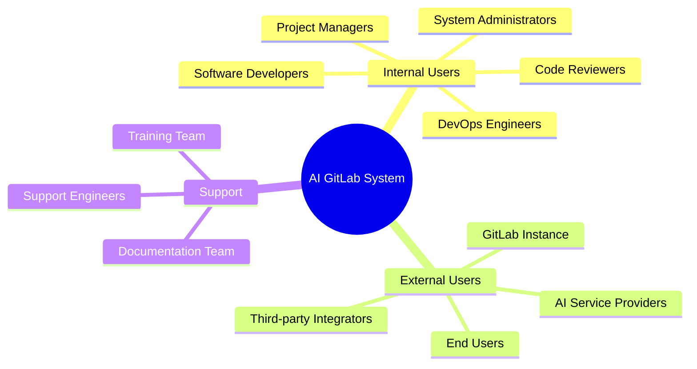

## 👥 User Personas

### 1. Software Developer (Alex)

**Profile**:
- **Age**: 28-35
- **Experience**: 5-8 years in software development
- **Tools**: VSCode, Git, Docker, various programming languages
- **Goals**: Write efficient code, reduce debugging time, accelerate development

**Context Diagram**:
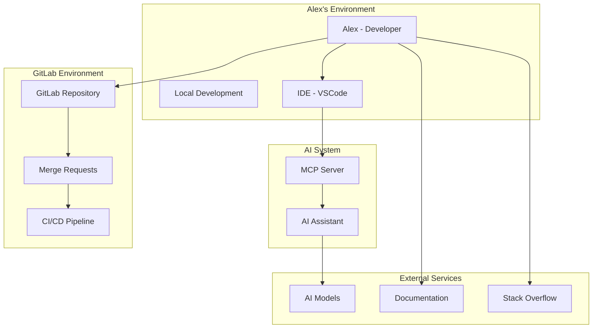

**Pain Points**:
- Time-consuming code reviews
- Difficulty understanding legacy code
- Manual documentation updates
- Repetitive coding tasks

**AI System Interactions**:
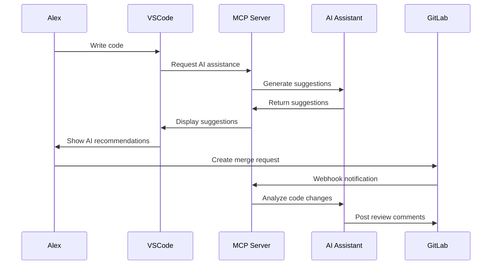

**Success Metrics**:
- 40% reduction in code review time
- 30% increase in code quality scores
- 50% faster documentation completion

### 2. DevOps Engineer (Sarah)

**Profile**:
- **Age**: 30-40
- **Experience**: 6-10 years in DevOps/Infrastructure
- **Tools**: Docker, Kubernetes, GitLab CI/CD, monitoring tools
- **Goals**: Optimize deployment pipelines, ensure system reliability

**Context Diagram**:
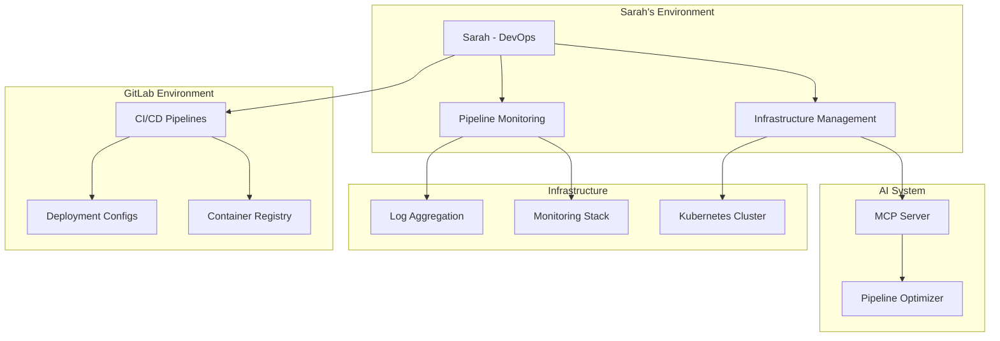

**Pain Points**:
- Pipeline optimization complexity
- Manual infrastructure scaling decisions
- Incident response time
- Resource utilization optimization

**AI System Interactions**:
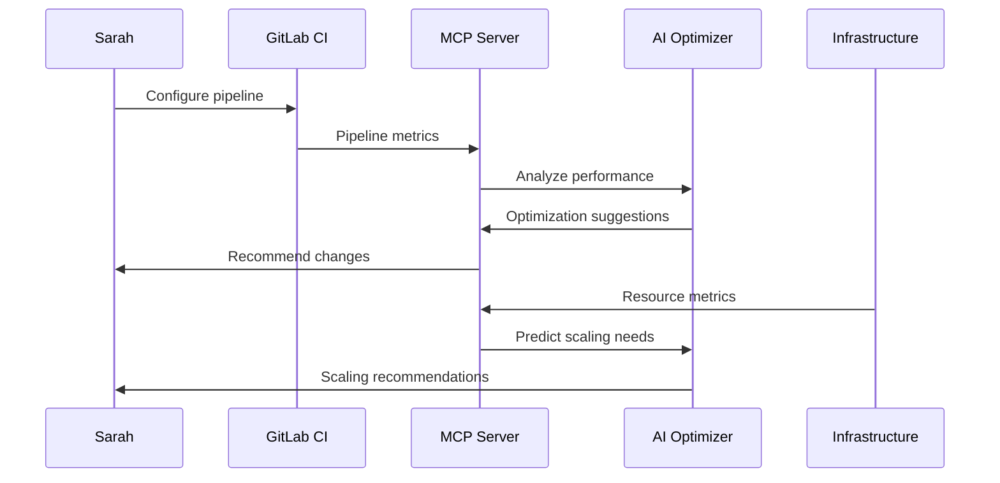

**Success Metrics**:
- 25% reduction in pipeline execution time
- 20% improvement in resource utilization
- 60% faster incident resolution

### 3. Code Reviewer (Marcus)

**Profile**:
- **Age**: 32-45
- **Experience**: 8-15 years, Senior/Lead Developer
- **Tools**: GitLab UI, IDE for code inspection, testing frameworks
- **Goals**: Maintain code quality, mentor team members, efficient reviews

**Context Diagram**:
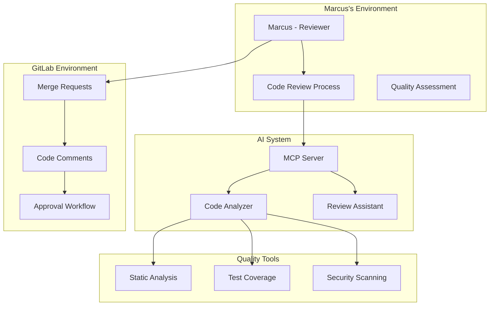

**Pain Points**:
- Large merge requests are overwhelming
- Inconsistent review quality
- Missing security vulnerabilities
- Time-consuming manual analysis

**AI System Interactions**:
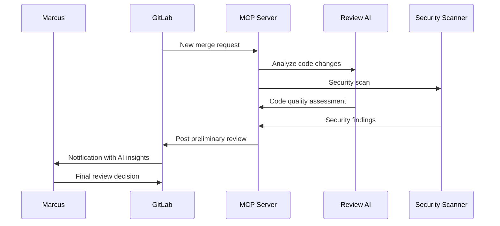

**Success Metrics**:
- 50% reduction in review time
- 35% increase in bug detection
- 90% consistency in review quality

### 4. Project Manager (Lisa)

**Profile**:
- **Age**: 35-50
- **Experience**: 10+ years in project management
- **Tools**: GitLab issues, project boards, reporting dashboards
- **Goals**: Track project progress, resource allocation, delivery predictability

**Context Diagram**:
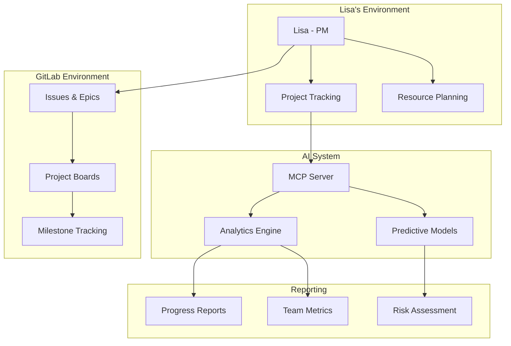

**Pain Points**:
- Inaccurate project estimations
- Resource allocation challenges
- Delayed issue identification
- Manual reporting overhead

**AI System Interactions**:
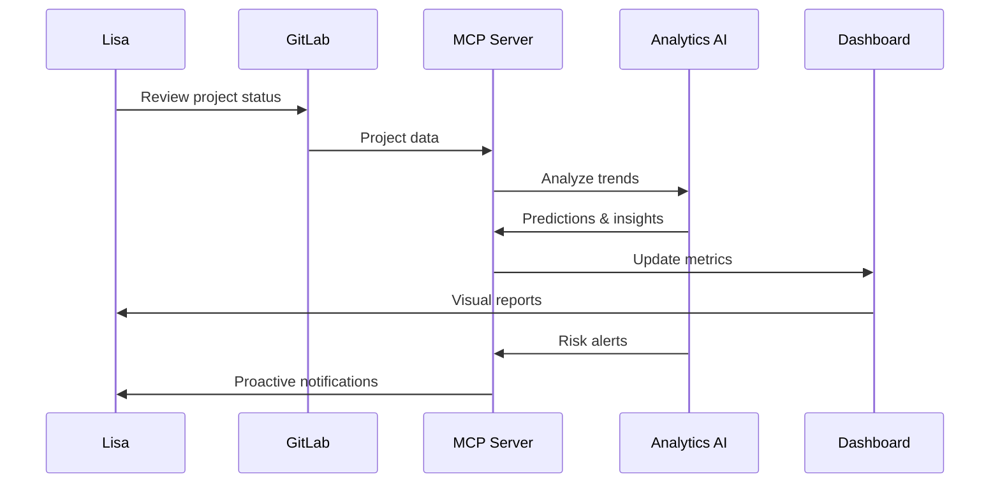

**Success Metrics**:
- 30% improvement in delivery predictions
- 25% reduction in project overruns
- 40% faster risk identification

## 🌍 External Personas

### 1. AI Service Provider (OpenAI/Anthropic)

**Profile**:
- **Type**: External API service
- **Reliability**: 99.9% uptime SLA
- **Capabilities**: Code generation, analysis, natural language processing

**Interaction Pattern**:
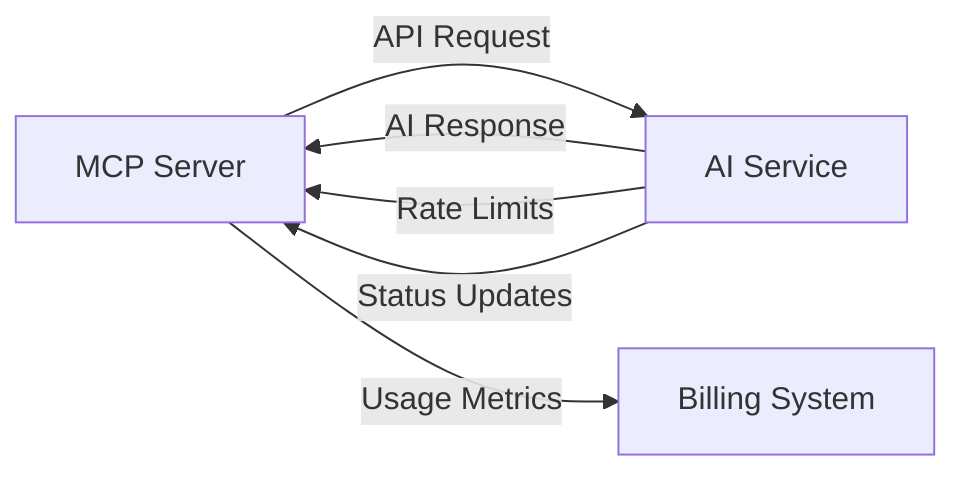

### 2. GitLab Instance Administrator

**Profile**:
- **Role**: System administrator for GitLab instance
- **Responsibilities**: User management, system configuration, security
- **Goals**: Maintain system security and performance

**Integration Points**:
- Webhook configuration
- API token management
- Security policy enforcement
- Performance monitoring

### 3. Third-party Integration Partners

**Profile**:
- **Type**: External service providers (monitoring, security, analytics)
- **Integration**: REST APIs, webhooks, data exports
- **Value**: Enhanced functionality and insights

## 🔄 Persona Journey Maps

### Developer Journey - Code Review Process

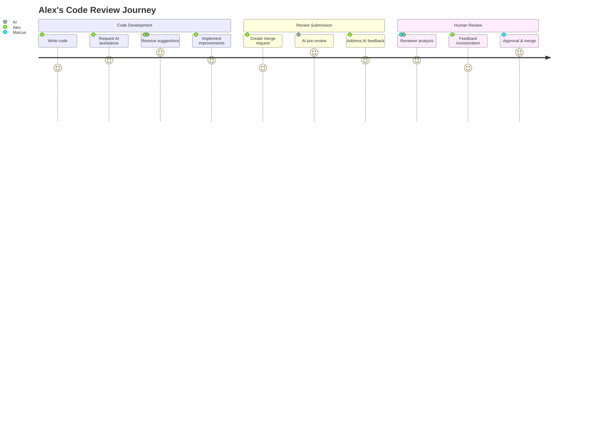

### DevOps Journey - Pipeline Optimization

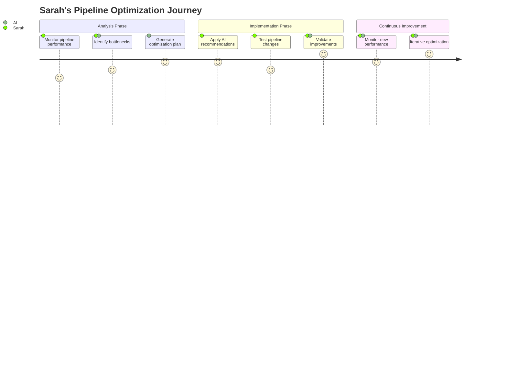

## 📊 Persona-Driven Requirements

### Functional Requirements by Persona

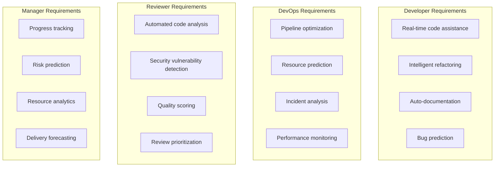

### Non-Functional Requirements

```yaml
performance:
  developers:
    - code_assistance_response: <2s
    - suggestion_accuracy: >85%
    - ide_integration_latency: <500ms
  
  devops:
    - pipeline_analysis: <30s
    - resource_prediction_accuracy: >80%
    - monitoring_data_freshness: <5min
  
  reviewers:
    - code_analysis: <10s
    - security_scan: <2min
    - review_summary: <5s
  
  managers:
    - dashboard_load: <3s
    - report_generation: <30s
    - data_freshness: <1hour
```

## 🎯 Persona Success Metrics

### Developer Success
- **Productivity**: Lines of quality code per day
- **Quality**: Defect density reduction
- **Satisfaction**: Developer experience surveys

### DevOps Success
- **Efficiency**: Pipeline execution time
- **Reliability**: Deployment success rate
- **Cost**: Infrastructure optimization savings

### Reviewer Success
- **Coverage**: Percentage of issues caught
- **Speed**: Time to complete reviews
- **Consistency**: Review quality variance

### Manager Success
- **Predictability**: Estimation accuracy
- **Visibility**: Project health transparency
- **ROI**: Development velocity improvement

This persona-driven approach ensures that the AI-enhanced GitLab system addresses real user needs and delivers measurable value to all stakeholders.
