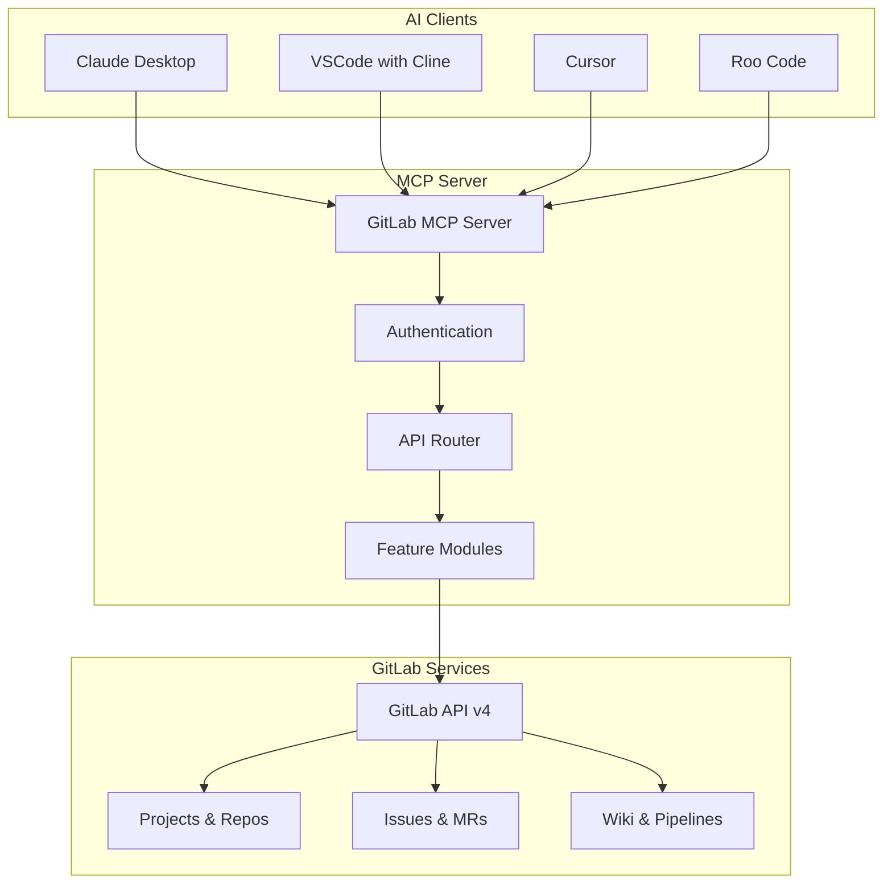
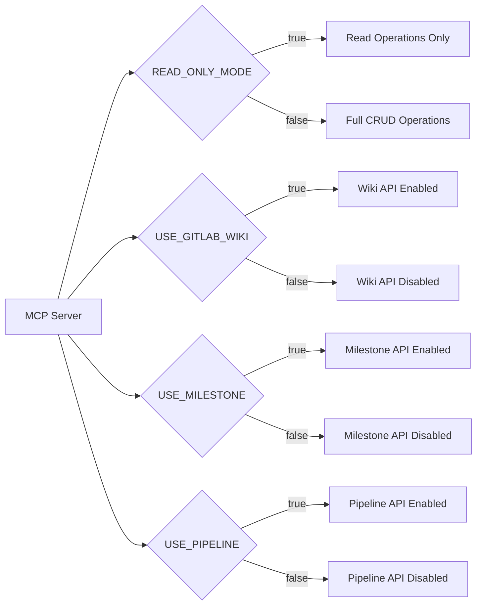

# GitLab MCP Server

## 🚀 Overview

The GitLab MCP (Model Context Protocol) Server by [@zereight](https://github.com/zereight/gitlab-mcp) is a powerful integration tool that enables AI assistants to interact directly with GitLab repositories through the standardized MCP protocol. This server includes bug fixes and improvements over the original GitLab MCP server implementation.

## 🎯 Key Features

### Core Capabilities
- **Project Management**: Full access to GitLab projects and repositories
- **Issue Tracking**: Create, read, update, and manage GitLab issues
- **Merge Request Management**: Handle merge requests and code reviews
- **Wiki Integration**: Access and manage GitLab wiki content (optional)
- **Milestone Tracking**: Manage project milestones and deadlines (optional)
- **Pipeline Operations**: Monitor and interact with CI/CD pipelines (optional)

### Security & Access Control
- **Personal Access Token**: Secure authentication using GitLab PAT
- **Read-Only Mode**: Optional restriction to read-only operations for enhanced security
- **Granular Permissions**: Fine-grained control over feature accessibility
- **API URL Configuration**: Support for both GitLab.com and self-hosted instances

### Integration Modes
- **stdio**: Standard input/output mode for direct integration
- **SSE (Server-Sent Events)**: Real-time event streaming
- **HTTP**: RESTful HTTP API integration
- **Docker**: Containerized deployment support

## 🏗️ Architecture



## 🔧 Configuration Options

### Environment Variables

| Variable | Description | Default | Required |
|----------|-------------|---------|----------|
| `GITLAB_PERSONAL_ACCESS_TOKEN` | Your GitLab personal access token | - | ✅ |
| `GITLAB_API_URL` | GitLab API endpoint URL | `https://gitlab.com/api/v4` | ❌ |
| `GITLAB_PROJECT_ID` | Default project ID for operations | - | ❌ |
| `GITLAB_READ_ONLY_MODE` | Restrict to read-only operations | `false` | ❌ |
| `USE_GITLAB_WIKI` | Enable wiki functionality | `false` | ❌ |
| `USE_MILESTONE` | Enable milestone functionality | `false` | ❌ |
| `USE_PIPELINE` | Enable pipeline functionality | `false` | ❌ |

### Feature Flags



## 🛠️ Installation Methods

### NPX (Recommended)
```bash
npx @zereight/mcp-gitlab
```

### Global Installation
```bash
npm install -g @zereight/mcp-gitlab
npx @zereight/mcp-gitlab
```

### Docker
```bash
docker run -i --rm \
  -e GITLAB_PERSONAL_ACCESS_TOKEN=your_token \
  -e GITLAB_API_URL="https://gitlab.com/api/v4" \
  -e GITLAB_READ_ONLY_MODE=false \
  -e USE_GITLAB_WIKI=true \
  -e USE_MILESTONE=true \
  -e USE_PIPELINE=true \
  iwakitakuma/gitlab-mcp
```

## 🔗 Integration Examples

### Claude Desktop App
```json
{
  "mcpServers": {
    "GitLab communication server": {
      "command": "npx",
      "args": ["-y", "@zereight/mcp-gitlab"],
      "env": {
        "GITLAB_PERSONAL_ACCESS_TOKEN": "your_gitlab_token",
        "GITLAB_API_URL": "your_gitlab_api_url",
        "GITLAB_READ_ONLY_MODE": "false",
        "USE_GITLAB_WIKI": "false",
        "USE_MILESTONE": "false",
        "USE_PIPELINE": "true"
      }
    }
  }
}
```

### VSCode with Cline/Cursor
```json
{
  "inputs": [
    {
      "type": "promptString",
      "id": "gitlab-token",
      "description": "GitLab Token to read API",
      "password": true
    }
  ],
  "servers": {
    "GitLab-MCP": {
      "type": "stdio",
      "command": "npx",
      "args": ["-y", "@zereight/mcp-gitlab"],
      "env": {
        "GITLAB_PERSONAL_ACCESS_TOKEN": "${input:gitlab-token}",
        "GITLAB_API_URL": "your-fancy-gitlab-url",
        "GITLAB_READ_ONLY_MODE": "true"
      }
    }
  }
}
```

### Server-Sent Events (SSE)
```bash
docker run -i --rm \
  -e GITLAB_PERSONAL_ACCESS_TOKEN=your_token \
  -e GITLAB_API_URL="https://gitlab.com/api/v4" \
  -e GITLAB_READ_ONLY_MODE=true \
  -e SSE=true \
  -p 3333:3002 \
  iwakitakuma/gitlab-mcp
```

```json
{
  "mcpServers": {
    "GitLab communication server": {
      "type": "sse",
      "url": "http://localhost:3333/sse"
    }
  }
}
```

## 🔐 Security Considerations

### Access Token Management
- **Scope Requirements**: Ensure your GitLab PAT has appropriate scopes
- **Token Rotation**: Regularly rotate access tokens
- **Environment Variables**: Never hardcode tokens in configuration files
- **Read-Only Mode**: Use for enhanced security when write operations aren't needed

### Recommended Token Scopes
- `api`: Full API access (required for full functionality)
- `read_api`: Read-only API access (for read-only mode)
- `read_repository`: Repository read access
- `write_repository`: Repository write access (if write operations needed)

## 📊 Supported GitLab Features

### ✅ Fully Supported
- Projects and repositories
- Issues and issue discussions
- Merge requests and reviews
- Repository files and content
- Branches and commits
- User and group management

### 🔄 Configurable Features
- Wiki pages and documentation
- Project milestones and iterations
- CI/CD pipelines and jobs
- Container registry operations

### ❌ Not Supported
- GitLab administration features
- System-level configuration
- License management
- Advanced security features

## 🚀 Use Cases

### Development Workflows
- **Code Review**: AI-assisted merge request reviews
- **Issue Triage**: Automated issue categorization and assignment
- **Documentation**: Automated wiki and README generation
- **Project Planning**: Milestone and iteration management

### DevOps Integration
- **Pipeline Monitoring**: Real-time CI/CD status tracking
- **Deployment Management**: Release and deployment coordination
- **Quality Assurance**: Automated testing and validation
- **Performance Analysis**: Metrics and analytics integration

## 🔗 Related Documentation

- **[Installation Guide](../implementation/setup.md)**: Step-by-step setup instructions
- **[Docker Configuration](../implementation/docker-compose.md)**: Container deployment details
- **[IDE Integration](../implementation/ide-config.md)**: IDE setup and configuration
- **[Use Cases](../use-cases/use-cases.md)**: Practical implementation examples
