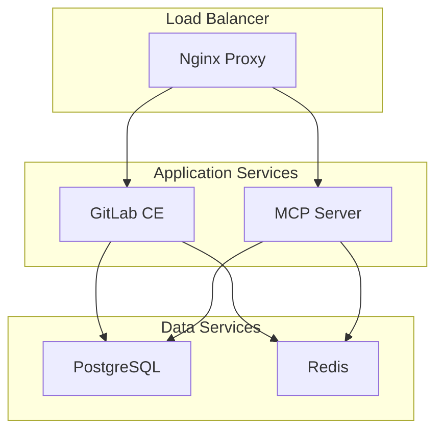

# Docker Compose Documentation

## Overview

This section provides comprehensive guidance on setting up the Docker Compose environment for the AI-enhanced GitLab development setup with a complete MCP server implementation.

## Architecture

The Docker Compose setup includes the following services:



## Services Overview

### 1. GitLab CE
- **Image**: `gitlab/gitlab-ce:latest`
- **Ports**: 8080 (HTTP), 2222 (SSH), 443 (HTTPS)
- **Features**: Container registry, GitLab Pages, CI/CD pipelines
- **Dependencies**: PostgreSQL, Redis

### 2. MCP Server
- **Image**: `iwakitakuma/gitlab-mcp:latest` (Native Docker image)
- **Port**: 3002
- **Features**: AI integration, GitLab API client, health monitoring
- **Dependencies**: GitLab (for API access)
- **Modes**: stdio, SSE, HTTP support

### 3. PostgreSQL
- **Image**: `postgres:13-alpine`
- **Purpose**: Database backend for GitLab and MCP server
- **Persistence**: Volume-mounted data directory

### 4. Redis
- **Image**: `redis:7-alpine`
- **Purpose**: Caching and session storage
- **Persistence**: Append-only file (AOF) enabled

### 5. Nginx
- **Image**: `nginx:alpine`
- **Purpose**: Load balancer and reverse proxy
- **Features**: SSL termination, static file serving, API routing

### Explanation

- **`gitlab`**: Main GitLab CE container
- **`postgresql`**: Database for GitLab
- **`redis`**: Caching service for GitLab
- **`mcp-server`**: AI integration server

### Networks and Volumes

- **Volumes**: Persist data to avoid data loss on container restart
- **Networks**: Bridge network for service interactions

## Running Docker Compose

### Building and Running Containers

```bash
# Start services
docker-compose up -d

# View running containers
docker-compose ps
```

### Access GitLab

- **Browser**: Open [http://localhost:8080](http://localhost:8080)

### Access MCP Server

- **Browser**: Open [http://localhost:3002](http://localhost:3002)

## Customization

### Environment Variables

Adjust configurations in the `.env` to customize behavior:

- Change ports, credentials, and other variables as needed

### Extending Configuration

Modify `docker-compose.yml` to adapt services:

- Add additional services
- Change network configurations
- Append volumes

## Troubleshooting

### Common Issues

- Verify port usage if services are not accessible
- Check container logs for error messages
- Ensure environment variables are properly configured

## Next Steps

1. Proceed to [IDE Configuration](ide-config.md) for IDE setup.
2. Verify all services are operational using the [Setup Guide](setup.md).


