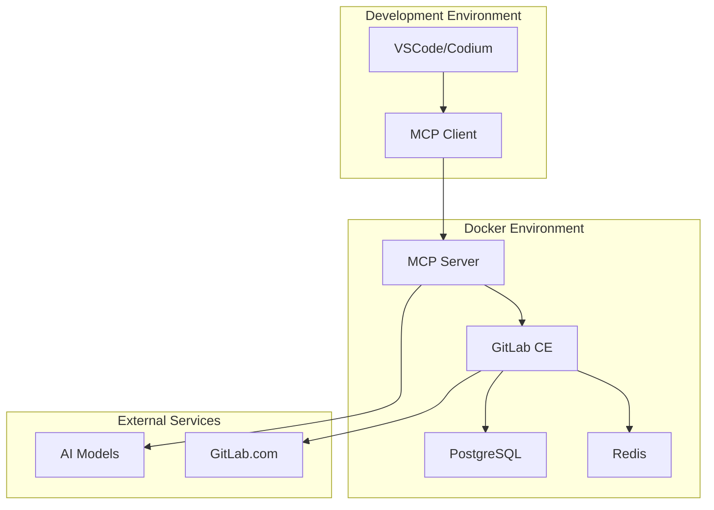

# Implementation Guide

## 🚀 Overview

This section provides comprehensive implementation guidance for setting up and deploying the AI-enhanced GitLab development environment, including prerequisites, setup instructions, and configuration details.

## 📚 Implementation Documents

### [Prerequisites](../prerequisites.md)
Essential requirements before starting:
- Required tools and software
- System requirements (hardware/OS)
- Network configuration
- Authentication setup
- Verification checklist

### [Setup Guide](setup.md)
Step-by-step installation process:
- Environment preparation
- Service configuration
- Docker Compose deployment
- GitLab initialization
- MCP server setup
- Health verification

### [Docker Compose Configuration](docker-compose.md)
Container orchestration details:
- Service definitions
- Network configuration
- Volume management
- Environment variables
- Scaling considerations

### [IDE Configuration](ide-config.md)
Development environment setup:
- VSCode/Codium extension installation
- MCP client configuration
- GitLab integration setup
- Workflow customization
- Troubleshooting guide

### [Contributing Guidelines](contributing.md)
Project contribution information:
- Development standards
- Pull request process
- Issue reporting
- Code of conduct
- Community guidelines

## 🛠️ Quick Start

1. **Check Prerequisites** → [../prerequisites.md](../prerequisites.md)
2. **Follow Setup Guide** → [setup.md](setup.md)
3. **Configure Docker** → [docker-compose.md](docker-compose.md)
4. **Setup IDE** → [ide-config.md](ide-config.md)
5. **Verify Installation** → Health checks and testing

## 🔧 Configuration Overview

### Environment Variables
```bash
# Core Services
GITLAB_URL=http://localhost:8080
GITLAB_TOKEN=your-access-token
MCP_SERVER_PORT=3000

# AI Integration
OPENAI_API_KEY=your-openai-key
ANTHROPIC_API_KEY=your-anthropic-key

# Database
POSTGRES_DB=gitlabhq_production
POSTGRES_USER=gitlab
POSTGRES_PASSWORD=secure-password
```

### Service Architecture


## 🎯 Implementation Phases

### Phase 1: Basic Setup
- [ ] Install prerequisites
- [ ] Configure Docker Compose
- [ ] Deploy core services
- [ ] Verify connectivity

### Phase 2: Integration
- [ ] Configure IDE extensions
- [ ] Set up GitLab webhooks
- [ ] Test AI assistance
- [ ] Validate workflows

### Phase 3: Optimization
- [ ] Performance tuning
- [ ] Security hardening
- [ ] Monitoring setup
- [ ] Documentation updates

## 📊 Health Checks

### Service Verification
```bash
# GitLab health
curl http://localhost:8080/-/health

# MCP server health
curl http://localhost:3000/health

# Database connectivity
docker-compose exec postgresql pg_isready -U gitlab
```

### Performance Monitoring
- Response times < 2s for AI assistance
- GitLab availability > 99.9%
- Database connection pool utilization
- Container resource usage

## 🔗 Quick Navigation

- **Prerequisites** → [../prerequisites.md](../prerequisites.md)
- **Setup Instructions** → [setup.md](setup.md)
- **Docker Configuration** → [docker-compose.md](docker-compose.md)
- **IDE Setup** → [ide-config.md](ide-config.md)
- **Contributing** → [contributing.md](contributing.md)
- **Design Documentation** → [../design/](../design/)
- **Use Cases** → [../use-cases/](../use-cases/)
