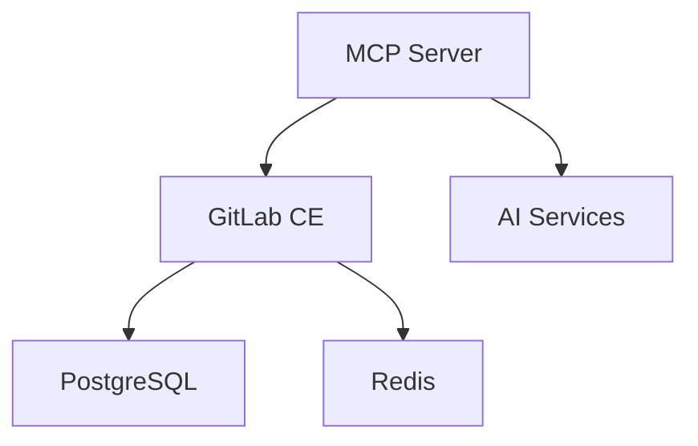

# Setup Guide

## 📋 Overview

This guide will walk you through setting up the AI-enhanced GitLab development environment step by step.

## 🏗️ GitLab Installation Options

This setup supports multiple GitLab installation methods to accommodate different operational models:

### Option 1: GitLab Omnibus (Docker) - Recommended
**Best for**: Development, testing, and small-to-medium production deployments

### Option 2: GitLab Omnibus (Native)
**Best for**: Large-scale production environments with dedicated infrastructure

### Option 3: GitLab Cloud (GitLab.com)
**Best for**: Teams wanting to focus on development without infrastructure management

---

## 🚀 Installation Steps

### Step 1: Clone the GitLab MCP Server

```bash
# Clone the GitLab MCP server repository
git clone https://github.com/zereight/gitlab-mcp.git
cd gitlab-mcp

# Review the project structure
ls -la
```

### Step 2: Prepare Environment Variables

Create a `.env` file for configuration:

```bash
# Copy the example environment file
cp .env.example .env

# Edit the environment file
nano .env
```

### Step 3: Configure Environment Variables

Edit your `.env` file with the following variables:

```bash
# GitLab Configuration
GITLAB_URL=http://localhost:8080
GITLAB_TOKEN=your-gitlab-access-token-here
GITLAB_ROOT_PASSWORD=your-secure-password

# MCP Server Configuration
MCP_SERVER_PORT=3000
MCP_SERVER_HOST=0.0.0.0

# AI Service Configuration
OPENAI_API_KEY=your-openai-api-key
# OR
ANTHROPIC_API_KEY=your-anthropic-api-key

# Database Configuration
POSTGRES_DB=gitlabhq_production
POSTGRES_USER=gitlab
POSTGRES_PASSWORD=gitlab-db-password
POSTGRES_HOST=postgresql

# Redis Configuration
REDIS_URL=redis://redis:6379
```

### Step 4: Choose Installation Method

#### Method A: Docker Compose (Default)
```bash
# Build and start all services
docker-compose up -d

# Check service status
docker-compose ps

# View logs
docker-compose logs -f
```

#### Method B: Native GitLab Omnibus
See the [GitLab Omnibus Native Installation](#gitlab-omnibus-native-installation) section below.

#### Method C: GitLab.com Integration
See the [GitLab.com Integration](#gitlabcom-integration) section below.

---

### Step 5: Build and Start Services (Docker Method)

```bash
# Build and start all services
docker-compose up -d

# Check service status
docker-compose ps

# View logs
docker-compose logs -f
```

### Step 5: GitLab Initial Setup

1. **Access GitLab**: Open [http://localhost:8080](http://localhost:8080)
2. **Set Root Password**: Use the password you set in `GITLAB_ROOT_PASSWORD`
3. **Login**: Username `root`, password from step 2
4. **Create Access Token**:
   - Navigate to User Settings → Access Tokens
   - Create token with `api`, `read_repository`, `write_repository` scopes
   - Update `.env` file with the new token

### Step 6: Verify MCP Server

```bash
# Test MCP server connectivity
curl http://localhost:3000/health

# Check MCP server logs
docker-compose logs mcp-server
```

## 🔧 Configuration Files

### Docker Compose Structure

The `docker-compose.yml` includes:

- **GitLab CE**: Complete GitLab instance
- **PostgreSQL**: Database backend
- **Redis**: Caching and session storage
- **MCP Server**: AI integration service

### Service Dependencies



## 🛠️ Troubleshooting

### Common Issues

#### GitLab Not Starting
```bash
# Check container logs
docker-compose logs gitlab

# Verify memory requirements (GitLab needs 4GB+)
docker stats

# Restart services
docker-compose restart
```

#### MCP Server Connection Failed
```bash
# Verify environment variables
cat .env | grep -E "(GITLAB|MCP)"

# Test GitLab API connectivity
curl -H "PRIVATE-TOKEN: your-token" http://localhost:8080/api/v4/user

# Restart MCP server
docker-compose restart mcp-server
```

#### Port Conflicts
```bash
# Check port usage
netstat -tulpn | grep -E "(8080|3000|2222)"

# Modify ports in docker-compose.yml if needed
```

### Service Health Checks

```bash
# GitLab health check
curl http://localhost:8080/-/health

# MCP server health check
curl http://localhost:3000/health

# Database connectivity
docker-compose exec postgresql pg_isready -U gitlab
```

## 📊 Monitoring and Logs

### Viewing Logs
```bash
# All services
docker-compose logs -f

# Specific service
docker-compose logs -f gitlab
docker-compose logs -f mcp-server

# Real-time monitoring
docker-compose logs -f --tail=50
```

### Resource Monitoring
```bash
# Container resource usage
docker stats

# Disk usage
docker system df
```

## 🔐 Security Considerations

### Secrets Management
- Never commit `.env` files to version control
- Use strong passwords for all services
- Regularly rotate access tokens
- Limit token permissions to minimum required

### Network Security
- Use HTTPS in production
- Configure firewall rules
- Implement proper authentication

## 🚀 Next Steps

Once setup is complete, proceed to:
1. [Docker Compose Configuration](docker-compose.md) for advanced configuration
2. [IDE Configuration](ide-config.md) for setting up your development environment

## 📝 Post-Setup Checklist

- [ ] GitLab accessible at http://localhost:8080
- [ ] MCP server responding at http://localhost:3000
- [ ] Environment variables properly configured
- [ ] Access tokens created and tested
- [ ] Services healthy and running
- [ ] Logs showing no critical errors
