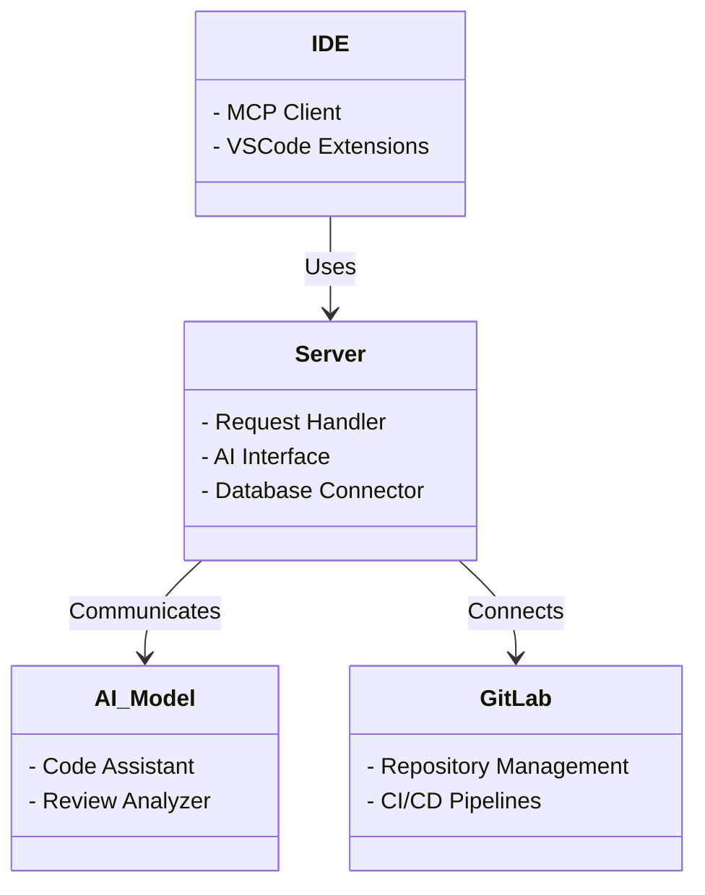

# Enhanced Developer Experience with AI and GitLab

## 🚀 Overview

This project aims to enhance the developer experience by integrating AI capabilities with GitLab through the Model Context Protocol (MCP). By combining these technologies, developers can leverage AI-powered assistance directly within their development workflow.

## 🎯 Key Features

- **AI-Powered Development**: Leverage advanced AI models to assist with code development
- **GitLab Integration**: Seamless integration with GitLab repositories and workflows
- **MCP Server**: Standardized protocol for AI-IDE communication
- **Docker Compose Setup**: Easy-to-deploy containerized environment
- **IDE Configuration**: Pre-configured setup for VSCode/Codium

## 🔄 Architecture Overview

### High-Level Architecture

Below is a diagram depicting the key components of the AI-enhanced GitLab environment and their interactions. The architecture includes seamless integration with IDEs, a centralized MCP server, and AI model interfaces.

```mermaid
flowchart TD
    subgraph IDE[IDE Environment]
    A[VSCode/Codium] -- B[MCP Client]
    end

    subgraph Server[MCP Server]
    B -- C[Request Handler]
    C -- D[AI Interface]
    D -- E[AI Models]
    end

    subgraph GitLab[GitLab Integration]
    B -- F[GitLab API]
    end

    subgraph Containers[Container Setup]
    G[Docker Compose] -- H[GitLab Instance]
    G -- I[MCP Server Container]
    end

    F --|Push/Pull Requests| I
    I --|Feedback| B
```

## 🖥️ Component-Model Design

The component-model design illustrates the modular setup of the system, focusing on reusability and efficiency:


### Architecture Context

The architecture context outlines the system’s comprehensive environment, including internal roles and interactions with external entities.

```mermaid
flowchart LR
    subgraph Internal
    M[Developer]
    N[MCP Server]
    end

    subgraph GitLab[GitLab Environment]
    O[GitLab Server]
    end

    subgraph External
    P[AI Services]
    Q[External APIs]
    end

    M --|Requests| N
    N --|API Calls| O
    N --|AI Queries| P
    O --|External Resources| Q
```

### Personas

- **Developer Persona**: Utilizes the IDE integrated with AI for enhanced coding efficiency.
- **AI Service**: Provides intelligent suggestions and feedback for the developer.
- **External APIs**: May include third-party integrations enhancing GitLab features.
- **GitLab Server**: Manages project repositories and CI/CD pipelines, interfacing directly with the MCP server.

## 📋 Use Cases

### Primary Use Cases
1. **IDE Integration**: Configure MCP server within your IDE for seamless AI assistance
2. **Local Development**: Set up a complete development environment using Docker Compose
3. **GitLab Workflow Enhancement**: Leverage AI for code reviews, issue management, and CI/CD optimization

### Secondary Use Cases
- Automated code documentation generation
- Intelligent code suggestions and refactoring
- Enhanced merge request analysis
- Automated testing recommendations

## 🏃‍♂️ Quick Start

1. **Prerequisites**: Ensure you have the required tools installed (see [Prerequisites](prerequisites.md))
2. **Setup**: Follow the setup guide to configure your environment (see [Setup](setup.md))
3. **Docker Compose**: Deploy the local GitLab and MCP server (see [Docker Compose](docker-compose.md))
4. **IDE Configuration**: Configure your IDE for optimal integration (see [IDE Configuration](ide-config.md))

## 📚 Documentation Structure

### 🎨 Design
- **[Architecture](design/architecture.md)**: System architecture and component interactions
- **[Component Model](design/component-model.md)**: Modular component design and patterns
- **[Context & Personas](design/context-and-personas.md)**: User personas and system context
- **[GitLab MCP Server](design/gitlab-mcp-server.md)**: Detailed GitLab MCP server capabilities and features

### 🎯 Use Cases
- **[All Use Cases](use-cases/use-cases.md)**: Comprehensive use case scenarios and examples

### 🔧 Implementation
- **[Prerequisites](prerequisites.md)**: Required tools and dependencies
- **[Setup Guide](implementation/setup.md)**: Step-by-step installation instructions
- **[Docker Compose](implementation/docker-compose.md)**: Container deployment and configuration
- **[MCP Integration](implementation/mcp-integration.md)**: GitLab MCP server integration with AI tools
- **[IDE Configuration](implementation/ide-config.md)**: IDE setup and customization
- **[Contributing](implementation/contributing.md)**: How to contribute to this project

## 🤝 Contributing

We welcome contributions! Please see our [Contributing Guide](contributing.md) for details on how to get started.
