# Enhanced Developer Experience with AI and GitLab

## 🚀 Overview

This project aims to enhance the developer experience by integrating AI capabilities with GitLab through the Model Context Protocol (MCP). By combining these technologies, developers can leverage AI-powered assistance directly within their development workflow.

## 🎯 Key Features

- **AI-Powered Development**: Leverage advanced AI models to assist with code development
- **GitLab Integration**: Seamless integration with GitLab repositories and workflows
- **MCP Server**: Standardized protocol for AI-IDE communication
- **Docker Compose Setup**: Easy-to-deploy containerized environment
- **IDE Configuration**: Pre-configured setup for VSCode/Codium

## 🔄 Use-Case Diagrams

### 🔍 Use-Case Analysis

```mermaid
flowchart TD
    subgraph Actors
        Developer[👨‍💻 Developer]
        ProjectManager[👔 Project Manager]
        Reviewer[🔍 Reviewer]
        Administrator[⚙️ Administrator]
    end
    
    subgraph UseCases["Use Cases"]
        WriteCode[Write Code]
        RequestAI[Request AI Assistance]
        CodeReview[Perform Code Review]
        TrackProgress[Track Progress]
        ManageRepos[Manage Repositories]
        
        RunTests[Run Tests]
        GenerateAI[Generate AI Suggestions]
        PostComments[Post Review Comments]
        GenerateReports[Generate Reports]
    end
    
    Developer --> WriteCode
    Developer --> RequestAI
    Reviewer --> CodeReview
    ProjectManager --> TrackProgress
    Administrator --> ManageRepos
    
    WriteCode -.-> RunTests
    RequestAI --> GenerateAI
    CodeReview --> PostComments
    TrackProgress --> GenerateReports
```

### 🌐 Context Diagram

```mermaid
flowchart LR
    subgraph Internal
        IDE[IDE Extensions]
        MCP[GitLab MCP Server]
    end
    
    subgraph GitLab[GitLab Environment]
        GitLabInstance["🦊 GitLab Server"]
    end
    
    subgraph External
        AIM[AI Models]
        Repos["🌐 External Code Repositories"]
    end
    
    Developer --> IDE
    IDE --> MCP
    MCP --> GitLabInstance
    MCP --> AIM
    GitLabInstance --> Repos
```

## 🔄 Architecture Overview

### High-Level Architecture

The architecture combines the official `iwakitakuma/gitlab-mcp` Docker image with our custom development environment, creating a comprehensive AI-enhanced GitLab ecosystem.

```mermaid
flowchart TB
    subgraph "Development Environment"
        subgraph IDE["IDE Layer"]
            A[VSCode/Codium]
            B[Claude Desktop]
            C[Cursor IDE]
        end
        
        subgraph Client["MCP Client Layer"]
            D[MCP Client Extensions]
            E[stdio/SSE/HTTP Protocols]
        end
    end

    subgraph "Container Infrastructure"
        subgraph Services["Core Services"]
            F["🐳 iwakitakuma/gitlab-mcp:latest<br/>Native MCP Server<br/>Port: 3002"]
            G["🦊 gitlab/gitlab-ce:latest<br/>GitLab Instance<br/>Port: 8080"]
        end
        
        subgraph Data["Data Layer"]
            H[PostgreSQL<br/>Database]
            I[Redis<br/>Cache]
        end
        
        subgraph Proxy["Load Balancer"]
            J[Nginx Proxy<br/>Port: 80]
        end
    end

    subgraph "External Services"
        K["🤖 AI Models<br/>OpenAI/Anthropic"]
        L["🌐 GitLab.com<br/>External Repos"]
    end

    subgraph "Custom Development"
        M["📚 MkDocs Documentation<br/>Material Theme"]
        N["🔧 Configuration Scripts<br/>Environment Setup"]
        O["🏗️ Docker Compose<br/>Orchestration"]
    end

    %% IDE to MCP connections
    A --> D
    B --> D
    C --> D
    D --> E
    
    %% MCP Client to Services
    E --> F
    E --> G
    
    %% Proxy routing
    J --> F
    J --> G
    
    %% Service dependencies
    F --> G
    G --> H
    G --> I
    
    %% External connections
    F --> K
    G --> L
    
    %% Custom development components
    O --> F
    O --> G
    O --> H
    O --> I
    O --> J
    
    %% Styling
    classDef nativeImage fill:#e1f5fe,stroke:#01579b,stroke-width:2px
    classDef customDev fill:#f3e5f5,stroke:#4a148c,stroke-width:2px
    classDef external fill:#e8f5e8,stroke:#1b5e20,stroke-width:2px
    
    class F,G nativeImage
    class M,N,O customDev
    class K,L external
```

### Architecture Components Breakdown

#### 🐳 Native Docker Images (Production-Ready)
| Component | Image | Purpose | Features |
|-----------|-------|---------|----------|
| **GitLab MCP Server** | `iwakitakuma/gitlab-mcp:latest` | AI-GitLab bridge | • Model Context Protocol implementation • Multi-mode support (stdio/SSE/HTTP) • GitLab API v4 integration • Real-time project synchronization |
| **GitLab CE** | `gitlab/gitlab-ce:latest` | Source control & DevOps | • Git repository management • CI/CD pipelines • Issue tracking & project management • Container registry & GitLab Pages |
| **PostgreSQL** | `postgres:13-alpine` | Database backend | • GitLab data persistence • Transactional consistency • Performance optimization |
| **Redis** | `redis:7-alpine` | Caching layer | • Session storage • Background job queuing • Performance acceleration |

#### 🔧 Custom Development Components
| Component | Type | Purpose | Benefits |
|-----------|------|---------|----------|
| **Docker Compose** | Orchestration | Service coordination | • One-command deployment • Environment isolation • Development consistency |
| **MkDocs Documentation** | Static site generator | Knowledge management | • Material Design theme • Mermaid diagram support • PDF export capability |
| **Nginx Configuration** | Reverse proxy | Load balancing & routing | • SSL termination • API endpoint routing • Static asset serving |
| **Environment Templates** | Configuration | Setup automation | • Quick deployment • Security best practices • Customizable parameters |

#### 🌐 Integration Flow

## 🖥️ Component-Model Design

The component-model design illustrates the modular setup of the system, focusing on reusability and efficiency:

### Architecture Context

The architecture context outlines the system’s comprehensive environment, including internal roles and interactions with external entities.

### Personas

- **Developer Persona**: Utilizes the IDE integrated with AI for enhanced coding efficiency.
- **AI Service**: Provides intelligent suggestions and feedback for the developer.
- **External APIs**: May include third-party integrations enhancing GitLab features.
- **GitLab Server**: Manages project repositories and CI/CD pipelines, interfacing directly with the MCP server.

## 🔒 Security, Compliance, and Data Privacy

### Security Considerations
- **Authentication**: Ensure that all services use strong authentication methods such as OAuth tokens or API keys.
- **Authorization**: Implement Role-Based Access Control (RBAC) to manage permissions.
- **Data Encryption**: Use TLS for data in transit and AES for data at rest to protect sensitive information.
- **Network Security**: Apply firewall rules and intrusion detection systems.

### Compliance Standards
- **GDPR Compliance**: Ensure that your handling of personal data adheres to the General Data Protection Regulation.
- **CCPA Compliance**: Implement the California Consumer Privacy Act requirements for user data.
- **Industry Standards**: Follow industry-specific standards like SOC 2 or HIPAA where applicable.

### Data Privacy
- **Data Minimization**: Collect only the data required for processing.
- **Anonymization**: Apply techniques to anonymize personal data where possible.
- **User Transparency**: Provide users with clear information on how their data is used.

---

## 📋 Use Cases

### Primary Use Cases
1. **IDE Integration**: Configure MCP server within your IDE for seamless AI assistance
2. **Local Development**: Set up a complete development environment using Docker Compose
3. **GitLab Workflow Enhancement**: Leverage AI for code reviews, issue management, and CI/CD optimization

### Secondary Use Cases
- Automated code documentation generation
- Intelligent code suggestions and refactoring
- Enhanced merge request analysis
- Automated testing recommendations

## 🏃‍♂️ Quick Start

1. **Prerequisites**: Ensure you have the required tools installed (see [Prerequisites](prerequisites.md))
2. **Setup**: Follow the setup guide to configure your environment (see [Setup](implementation/setup.md))
3. **Docker Compose**: Deploy the local GitLab and MCP server (see [Docker Compose](implementation/docker-compose.md))
4. **IDE Configuration**: Configure your IDE for optimal integration (see [IDE Configuration](implementation/ide-config.md))

## 📚 Documentation Structure

### 🎨 Design
- **[Architecture](design/architecture.md)**: System architecture and component interactions
- **[Component Model](design/component-model.md)**: Modular component design and patterns
- **[Context & Personas](design/context-and-personas.md)**: User personas and system context
- **[GitLab MCP Server](design/gitlab-mcp-server.md)**: Detailed GitLab MCP server capabilities and features

### 🔒 Security & Compliance
- **[Security Overview](security/security.md)**: Comprehensive security measures and architecture
- **[Compliance Standards](security/compliance.md)**: Legal and industry compliance requirements
- **[Data Privacy](security/data-privacy.md)**: Data protection and privacy implementation

### 🔍 Analysis
- **[GitLab Duo vs MCP Overlap](analysis/gitlab-duo-mcp-overlap.md)**: Feature comparison and strategic positioning analysis

### 🎯 Use Cases
- **[All Use Cases](use-cases/use-cases.md)**: Comprehensive use case scenarios and examples

### 🔧 Implementation
- **[Prerequisites](prerequisites.md)**: Required tools and dependencies
- **[Setup Guide](implementation/setup.md)**: Step-by-step installation instructions
- **[Docker Compose](implementation/docker-compose.md)**: Container deployment and configuration
- **[MCP Integration](implementation/mcp-integration.md)**: GitLab MCP server integration with AI tools
- **[IDE Configuration](implementation/ide-config.md)**: IDE setup and customization
- **[Contributing](implementation/contributing.md)**: How to contribute to this project

## 🤝 Contributing

We welcome contributions! Please see our [Contributing Guide](implementation/contributing.md) for details on how to get started.
