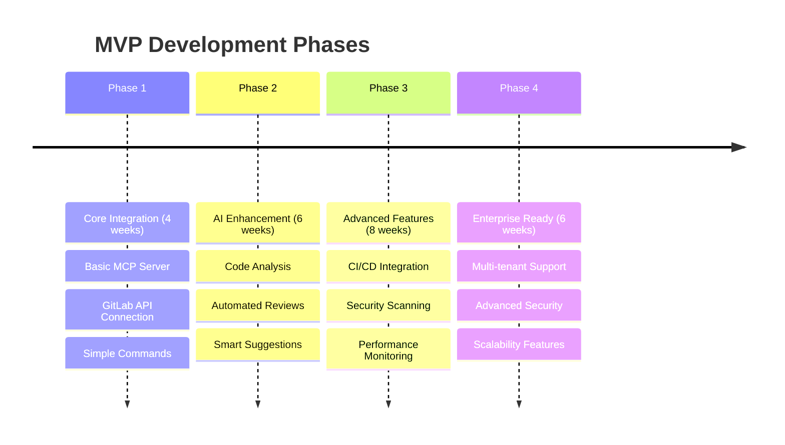
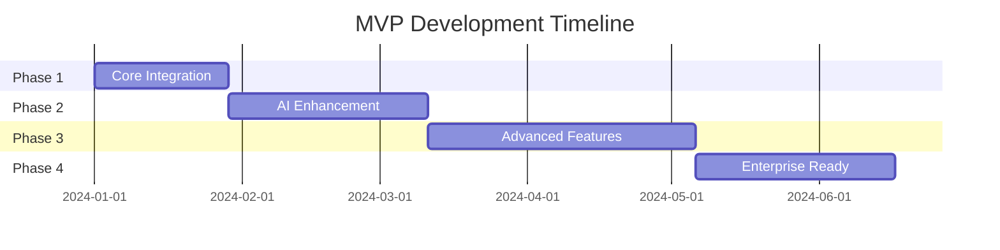

<!-- _class: lead -->
# MVP Allotments
## MCP-GitLab Implementation Strategy

### Phased Development Approach
#### Resource Allocation & Timeline Planning

---
<style scoped>
section {
  font-size: 24px;
}
</style>
## MVP Strategy Overview

### 🎯 Core Philosophy
**Build → Measure → Learn** iterative approach

- **Minimum Viable Product**: Core features only
- **Rapid Prototyping**: Fast feedback loops
- **Incremental Value**: Each phase adds user value
- **Risk Mitigation**: Validate assumptions early

### 📈 Success Criteria
- **User Adoption**: 80% team engagement
- **Performance Gains**: 25% productivity improvement
- **Quality Metrics**: 30% reduction in defects
- **ROI Achievement**: Break-even by month 3

---
<style scoped>
section {
  font-size: 24px;
}
</style>
## MVP Phasing Strategy



---
<style scoped>
section {
  font-size: 22px;
}
</style>
## Phase 1: Core Integration MVP

### 🚀 **Duration**: 4 weeks | **Priority**: Critical

#### **Core Features**
- ✅ **MCP Server Setup**: Basic protocol implementation
- ✅ **GitLab API Integration**: Authentication & basic operations
- ✅ **Essential Commands**: Project listing, issue management
- ✅ **Docker Deployment**: Containerized solution
- ✅ **Basic Documentation**: Setup and usage guides

#### **Success Metrics**
- MCP server responds to basic commands
- Successfully connects to GitLab instance
- Can list projects and create issues
- Docker container runs without errors

---
<style scoped>
section {
  font-size: 24px;
}
</style>
## Phase 1: Resource Allocation

### 👥 **Team Structure**
| Role | Allocation | Responsibilities |
|------|------------|------------------|
| **Technical Lead** | 100% (4 weeks) | Architecture, code review, decisions |
| **Backend Developer** | 100% (4 weeks) | MCP server implementation |
| **DevOps Engineer** | 50% (2 weeks) | Docker setup, deployment |
| **QA Engineer** | 25% (1 week) | Testing framework setup |

### 💰 **Budget Breakdown**
- **Personnel**: $32,000 (4 people × varying allocations)
- **Infrastructure**: $800 (testing environments)
- **Tools & Licenses**: $400
- **Total Phase 1**: $33,200

---
<style scoped>
section {
  font-size: 24px;
}
</style>
## Phase 1: Technical Specifications

### 🛠️ **Technology Stack**
```yaml
Backend:
  - Runtime: Node.js 18+
  - Framework: Express.js / Fastify
  - Protocol: MCP (JSON-RPC)
  - GitLab: REST API v4

Infrastructure:
  - Container: Docker
  - Orchestration: Docker Compose
  - Database: SQLite (development)
  - Logging: Winston

Testing:
  - Unit: Jest
  - Integration: Supertest
  - E2E: Playwright
```

---
<style scoped>
section {
  font-size: 22px;
}
</style>
## Phase 1: Deliverables & Milestones

### 📦 **Week 1-2 Deliverables**
- [x] Project structure and initial setup
- [x] MCP protocol basic implementation
- [x] GitLab API client library
- [x] Docker configuration
- [x] Development environment setup

### 📦 **Week 3-4 Deliverables**
- [x] Core MCP tools implementation
- [x] Basic error handling and logging
- [x] Unit and integration tests
- [x] Documentation and setup guides
- [x] MVP demo and presentation

---
<style scoped>
section {
  font-size: 22px;
}
</style>
## Phase 2: AI Enhancement MVP

### 🧠 **Duration**: 6 weeks | **Priority**: High

#### **Enhanced Features**
- 🔍 **Code Analysis**: Static code review capabilities
- 🤖 **AI-Powered Suggestions**: Code improvement recommendations
- 📊 **Quality Metrics**: Code quality dashboard
- 🔄 **Automated Reviews**: PR review automation
- 📝 **Smart Comments**: Context-aware code comments

#### **Success Metrics**
- AI suggestions have 70% acceptance rate
- Code review time reduced by 40%
- Quality metrics show upward trend
- User satisfaction score > 4.0/5.0

---
<style scoped>
section {
  font-size: 20px;
}
</style>
## Phase 2: Resource Allocation

### 👥 **Enhanced Team Structure**
| Role | Allocation | Responsibilities |
|------|------------|------------------|
| **Technical Lead** | 75% (4.5 weeks) | AI integration, architecture |
| **AI/ML Engineer** | 100% (6 weeks) | Code analysis algorithms |
| **Backend Developer** | 100% (6 weeks) | Feature implementation |
| **Frontend Developer** | 50% (3 weeks) | Dashboard and UI |
| **DevOps Engineer** | 25% (1.5 weeks) | Deployment optimization |

### 💰 **Budget Breakdown**
- **Personnel**: $68,000
- **AI/ML Services**: $2,400
- **Infrastructure**: $1,800
- **Total Phase 2**: $72,200

---
<style scoped>
section {
  font-size: 22px;
}
</style>
## Phase 3: Advanced Features MVP

### ⚡ **Duration**: 8 weeks | **Priority**: Medium-High

#### **Advanced Capabilities**
- 🔧 **CI/CD Integration**: Pipeline automation and monitoring
- 🛡️ **Security Scanning**: Vulnerability detection and reporting
- 📈 **Performance Monitoring**: Real-time metrics and alerting
- 🔄 **Workflow Automation**: Custom workflow creation
- 📊 **Advanced Analytics**: Detailed reporting and insights

#### **Success Metrics**
- 90% pipeline automation achieved
- Security vulnerabilities detected in real-time
- Performance monitoring covers all critical paths
- Custom workflows reduce manual tasks by 50%

---
<style scoped>
section {
  font-size: 20px;
}
</style>
## Phase 3: Resource Allocation

### 👥 **Full Team Deployment**
| Role | Allocation | Responsibilities |
|------|------------|------------------|
| **Technical Lead** | 100% (8 weeks) | Overall coordination |
| **Backend Developers** | 200% (16 weeks total) | Feature development |
| **Security Engineer** | 50% (4 weeks) | Security implementations |
| **DevOps Engineers** | 100% (8 weeks) | CI/CD and monitoring |
| **QA Engineers** | 75% (6 weeks) | Comprehensive testing |

### 💰 **Budget Breakdown**
- **Personnel**: $108,000
- **Security Tools**: $4,000
- **Monitoring Services**: $2,400
- **Infrastructure**: $3,200
- **Total Phase 3**: $117,600

---
<style scoped>
section {
  font-size: 22px;
}
</style>
## Phase 4: Enterprise Ready

### 🏢 **Duration**: 6 weeks | **Priority**: Medium

#### **Enterprise Features**
- 🏗️ **Multi-tenant Architecture**: Support multiple organizations
- 🔐 **Advanced Security**: SSO, RBAC, audit trails
- 📈 **Scalability**: Horizontal scaling capabilities
- 🔄 **High Availability**: Redundancy and failover
- 📊 **Enterprise Analytics**: Advanced reporting and compliance

#### **Success Metrics**
- Supports 10+ concurrent tenants
- 99.9% uptime achieved
- Enterprise security compliance verified
- Scales to 100+ concurrent users

---
<style scoped>
section {
  font-size: 18px;
}
</style>
## Phase 4: Resource Allocation

### 👥 **Enterprise Team Structure**
| Role | Allocation | Responsibilities |
|------|------------|------------------|
| **Solutions Architect** | 100% (6 weeks) | Enterprise architecture |
| **Senior Backend Developers** | 200% (12 weeks) | Scalability features |
| **Security Architect** | 75% (4.5 weeks) | Enterprise security |
| **DevOps Lead** | 100% (6 weeks) | Production deployment |
| **Compliance Specialist** | 25% (1.5 weeks) | Regulatory compliance |

### 💰 **Budget Breakdown**
- **Personnel**: $96,000
- **Enterprise Tools**: $8,000
- **Compliance Audits**: $12,000
- **Infrastructure**: $6,000
- **Total Phase 4**: $122,000

---
<style scoped>
section {
  font-size: 22px;
}
</style>
## Total MVP Investment Summary

### 💰 **Financial Overview**

| Phase | Duration | Personnel Cost | Other Costs | Total Cost |
|-------|----------|----------------|-------------|------------|
| **Phase 1** | 4 weeks | $32,000 | $1,200 | $33,200 |
| **Phase 2** | 6 weeks | $68,000 | $4,200 | $72,200 |
| **Phase 3** | 8 weeks | $108,000 | $9,600 | $117,600 |
| **Phase 4** | 6 weeks | $96,000 | $26,000 | $122,000 |
| **Total** | **24 weeks** | **$304,000** | **$41,000** | **$345,000** |

### 📊 **ROI Projection**
- **Break-even**: Month 8
- **12-month ROI**: 180%
- **24-month ROI**: 420%

---
<style scoped>
section {
  font-size: 24px;
}
</style>
## Risk Management & Contingencies

### ⚠️ **High-Risk Areas**

| Risk | Impact | Mitigation | Contingency Budget |
|------|--------|------------|-------------------|
| **Technical Complexity** | High | Expert consultation | $25,000 |
| **Timeline Delays** | Medium | Buffer time allocation | $15,000 |
| **Integration Issues** | Medium | Phased testing | $10,000 |
| **Team Availability** | Low | Flexible contracting | $20,000 |

### 🛡️ **Total Contingency**: $70,000 (20% of total budget)

---
<style scoped>
section {
  font-size: 18px;
}
</style>
## Success Measurement Framework

### 📊 **KPI Dashboard**

#### **Technical KPIs**
- **Performance**: Response time < 100ms
- **Reliability**: 99.5% uptime
- **Quality**: Test coverage > 90%
- **Security**: Zero critical vulnerabilities

#### **Business KPIs**
- **User Adoption**: 85% team usage
- **Productivity**: 30% improvement
- **Cost Savings**: $50,000 annual savings
- **Satisfaction**: Net Promoter Score > 8

#### **Operational KPIs**
- **Deployment**: < 5 minutes deploy time
- **Recovery**: < 15 minutes MTTR
- **Maintenance**: < 4 hours/week effort
- **Support**: < 24-hour response time

---
<style scoped>
section {
  font-size: 22px;
}
</style>
## Resource Allocation Timeline

### 📅 **Team Ramp-up Schedule**



### 👥 **Peak Resource Requirements**
- **Phase 3**: Highest team size (5.75 FTE)
- **Phase 4**: Highest specialization requirements
- **Overlap Periods**: Careful resource management needed

---
<style scoped>
section {
  font-size: 18px;
}
</style>
## Quality Assurance Strategy

### 🧪 **Testing Approach**

#### **Phase 1**: Foundation Testing
- Unit tests for all core functions
- Integration tests for GitLab API
- Docker container testing
- Basic performance testing

#### **Phase 2-3**: Comprehensive Testing
- AI model accuracy testing
- User acceptance testing
- Performance and load testing
- Security penetration testing

#### **Phase 4**: Enterprise Testing
- Multi-tenant isolation testing
- High availability testing
- Compliance verification
- Scalability testing

---
<style scoped>
section {
  font-size: 20px;
}
</style>
## Training & Change Management

### 📚 **Training Program**

#### **Phase 1**: Basic Training (Week 4)
- **Duration**: 8 hours
- **Audience**: Development team
- **Content**: Basic usage, setup, troubleshooting

#### **Phase 2**: Advanced Training (Week 10)
- **Duration**: 16 hours
- **Audience**: Extended team
- **Content**: AI features, optimization, best practices

#### **Phase 4**: Enterprise Training (Week 24)
- **Duration**: 24 hours
- **Audience**: All stakeholders
- **Content**: Complete platform, administration, governance

---
<style scoped>
section {
  font-size: 20px;
}
</style>
## Go-Live Strategy

### 🚀 **Deployment Approach**

#### **Soft Launch** (Phase 1 completion)
- **Scope**: Core team (5 developers)
- **Duration**: 2 weeks
- **Objective**: Basic functionality validation

#### **Beta Release** (Phase 2 completion)
- **Scope**: Extended team (15 users)
- **Duration**: 4 weeks
- **Objective**: AI features validation

#### **Full Production** (Phase 3 completion)
- **Scope**: Entire organization (50+ users)
- **Duration**: Ongoing
- **Objective**: Complete feature set deployment

---
<style scoped>
section {
  font-size: 20px;
}
</style>
## Success Celebration & Retrospective

### 🎉 **Milestone Celebrations**

#### **Phase 1 Success**: "Foundation Complete"
- Team lunch and recognition
- Demo presentation to stakeholders
- Project retrospective session

#### **Phase 2 Success**: "AI Integration Achieved"
- Company-wide presentation
- Case study documentation
- Industry conference submission

#### **Phase 4 Success**: "Enterprise Ready"
- Launch event and press release
- Customer success story development
- Award submission preparation

---

<!-- _class: lead -->
# MVP Roadmap Complete

## Ready for Implementation

### 🚀 **Let's build the future, one phase at a time!**

**Total Investment**: $345,000 + $70,000 contingency
**Expected ROI**: 420% over 24 months
**Timeline**: 24 weeks to full enterprise deployment
