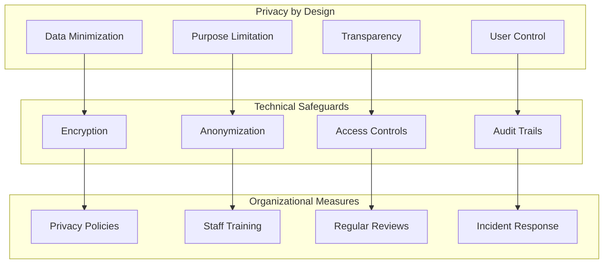
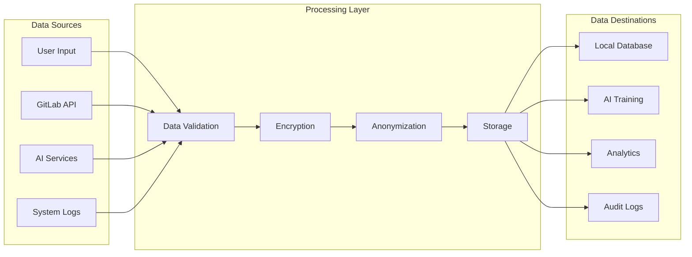
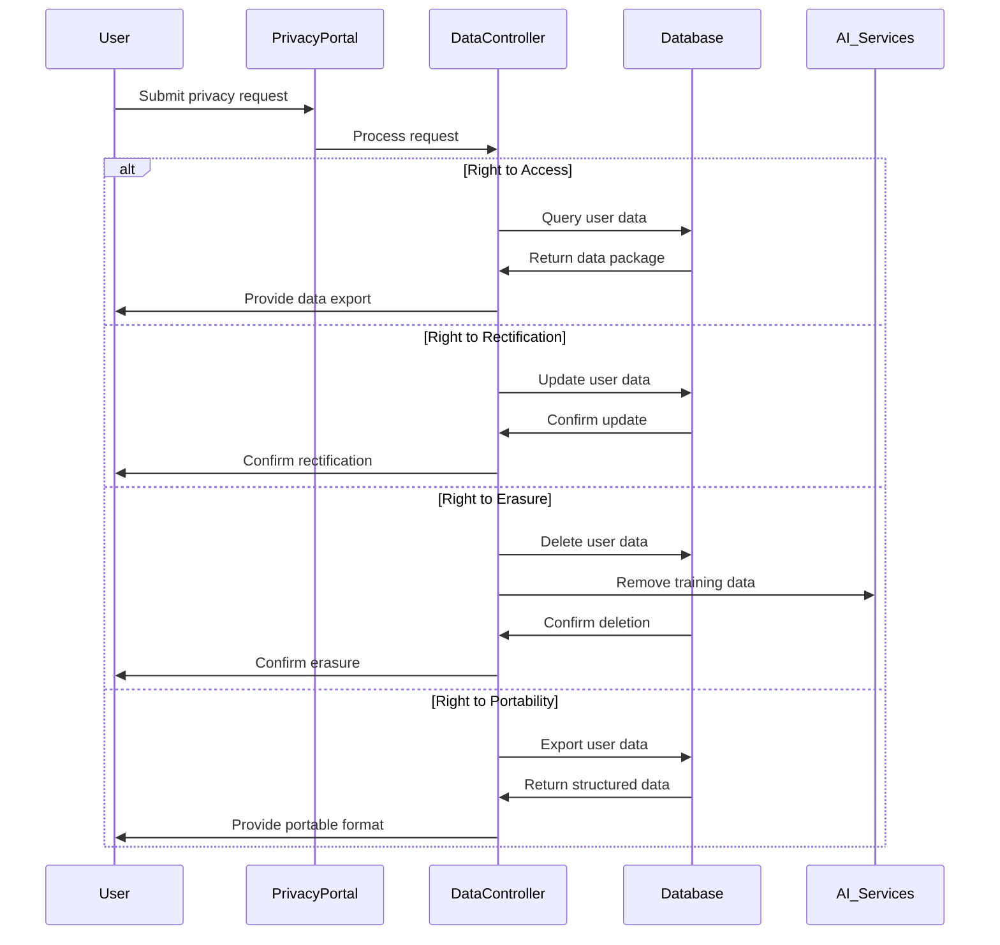

# Data Privacy Protection

## 🔐 Introduction

Data privacy is a cornerstone of the AI-enhanced GitLab development environment. This document outlines the comprehensive data privacy measures, policies, and practices implemented to protect user data and ensure compliance with global privacy regulations.

## 🎯 Privacy Principles

### Core Privacy Values



## 📊 Data Classification

### Data Categories

| Category | Description | Retention Period | Access Level |
|----------|-------------|------------------|--------------|
| **Personal Data** | User identifiers, contact information | 2 years after last activity | Restricted |
| **Technical Data** | API tokens, configuration settings | 1 year after deactivation | Limited |
| **Usage Data** | Activity logs, performance metrics | 6 months | Internal Only |
| **AI Training Data** | Anonymized code snippets, patterns | 3 years | Research Team |

### Data Flow Mapping



## 🛡️ Privacy-Preserving Technologies

### Differential Privacy

```typescript
// Example implementation of differential privacy
interface DifferentialPrivacyConfig {
  epsilon: number; // Privacy parameter
  delta: number;   // Failure probability
  sensitivity: number; // Global sensitivity
}

class DifferentialPrivacy {
  private config: DifferentialPrivacyConfig;
  
  constructor(config: DifferentialPrivacyConfig) {
    this.config = config;
  }
  
  addNoise(value: number): number {
    const scale = this.config.sensitivity / this.config.epsilon;
    const noise = this.laplacianNoise(scale);
    return value + noise;
  }
  
  private laplacianNoise(scale: number): number {
    // Generate Laplacian noise
    const u = Math.random() - 0.5;
    return -scale * Math.sign(u) * Math.log(1 - 2 * Math.abs(u));
  }
}
```

### Data Anonymization

```yaml
# Anonymization pipeline configuration
anonymization:
  techniques:
    - k_anonymity:
        k: 5
        quasi_identifiers:
          - "user_id"
          - "timestamp"
          - "project_id"
    
    - l_diversity:
        l: 3
        sensitive_attributes:
          - "code_content"
    
    - pseudonymization:
        salt: "${ANONYMIZATION_SALT}"
        algorithm: "SHA-256"
        
  data_retention:
    raw_data: "30_days"
    anonymized_data: "3_years"
    aggregated_data: "5_years"
```

### Homomorphic Encryption

```python
# Example of homomorphic encryption for secure computation
from phe import paillier

def secure_computation_example():
    # Generate keypair
    public_key, private_key = paillier.generate_paillier_keypair()
    
    # Encrypt sensitive data
    secret_value1 = 15
    secret_value2 = 25
    
    encrypted1 = public_key.encrypt(secret_value1)
    encrypted2 = public_key.encrypt(secret_value2)
    
    # Perform computation on encrypted data
    encrypted_sum = encrypted1 + encrypted2
    encrypted_product = encrypted1 * 3
    
    # Decrypt results
    decrypted_sum = private_key.decrypt(encrypted_sum)
    decrypted_product = private_key.decrypt(encrypted_product)
    
    return decrypted_sum, decrypted_product
```

## 👤 User Rights Management

### GDPR Rights Implementation



### User Consent Management

```typescript
interface ConsentRecord {
  userId: string;
  consentType: string;
  granted: boolean;
  timestamp: Date;
  version: string;
  ipAddress: string;
}

class ConsentManager {
  private storage: ConsentStorage;
  
  async recordConsent(consent: ConsentRecord): Promise<void> {
    // Validate consent record
    if (!this.validateConsent(consent)) {
      throw new Error('Invalid consent record');
    }
    
    // Store consent with timestamp and version
    await this.storage.store(consent);
    
    // Log consent action for audit
    await this.auditLog({
      action: 'consent_granted',
      userId: consent.userId,
      consentType: consent.consentType,
      timestamp: new Date()
    });
  }
  
  async revokeConsent(userId: string, consentType: string): Promise<void> {
    const revocation: ConsentRecord = {
      userId,
      consentType,
      granted: false,
      timestamp: new Date(),
      version: this.getCurrentVersion(),
      ipAddress: this.getCurrentIP()
    };
    
    await this.storage.store(revocation);
    
    // Trigger data processing updates
    await this.updateDataProcessing(userId, consentType, false);
  }
}
```

## 🔍 Privacy Impact Assessment (PIA)

### Assessment Framework

```yaml
privacy_impact_assessment:
  scope:
    data_types:
      - personal_identifiers
      - behavioral_data
      - technical_logs
      - ai_generated_content
    
    processing_purposes:
      - code_assistance
      - performance_analytics
      - security_monitoring
      - service_improvement
  
  risks:
    high_risk:
      - unauthorized_access
      - data_breach
      - inference_attacks
      - model_inversion
    
    medium_risk:
      - data_minimization_failure
      - consent_management_issues
      - third_party_sharing
    
    low_risk:
      - aggregated_analytics
      - pseudonymized_research
  
  mitigation_measures:
    technical:
      - end_to_end_encryption
      - differential_privacy
      - secure_multi_party_computation
      - zero_knowledge_proofs
    
    organizational:
      - privacy_by_design
      - regular_audits
      - staff_training
      - incident_response_plan
```

### Risk Assessment Matrix

| Risk Level | Likelihood | Impact | Mitigation Priority |
|------------|------------|---------|-------------------|
| **Critical** | High | Severe | Immediate |
| **High** | Medium | Major | Within 30 days |
| **Medium** | Low | Moderate | Within 90 days |
| **Low** | Very Low | Minor | Next review cycle |

## 📋 Privacy Policies

### Data Processing Notice

```markdown
# Data Processing Notice

## What data we collect
- User identifiers (usernames, email addresses)
- Technical data (IP addresses, browser information)
- Usage data (feature interactions, performance metrics)
- Content data (code snippets for AI training - anonymized)

## Why we collect it
- Provide AI-enhanced development assistance
- Improve service performance and reliability
- Ensure security and prevent abuse
- Conduct research and development (anonymized data only)

## How we protect it
- End-to-end encryption for data in transit
- AES-256 encryption for data at rest
- Access controls and audit logging
- Regular security assessments

## Your rights
- Access your personal data
- Correct inaccurate information
- Request data deletion
- Data portability
- Withdraw consent
```

### Cookies and Tracking Policy

```javascript
// Cookie consent implementation
class CookieConsent {
  constructor() {
    this.consentTypes = {
      essential: { required: true, description: 'Required for basic functionality' },
      analytics: { required: false, description: 'Help us improve our service' },
      preferences: { required: false, description: 'Remember your settings' }
    };
  }
  
  showConsentBanner() {
    const banner = document.createElement('div');
    banner.className = 'cookie-consent-banner';
    banner.innerHTML = this.generateBannerHTML();
    document.body.appendChild(banner);
  }
  
  handleConsentChoice(choices) {
    // Store consent preferences
    localStorage.setItem('cookie-consent', JSON.stringify({
      choices,
      timestamp: Date.now(),
      version: '1.0'
    }));
    
    // Configure cookies based on consent
    this.configureCookies(choices);
  }
}
```

## 🛠️ Privacy-Preserving Implementation

### Secure Data Handling

```typescript
class SecureDataHandler {
  private encryptionKey: string;
  
  constructor(key: string) {
    this.encryptionKey = key;
  }
  
  async encryptSensitiveData(data: any): Promise<string> {
    const crypto = require('crypto');
    const cipher = crypto.createCipher('aes-256-gcm', this.encryptionKey);
    
    let encrypted = cipher.update(JSON.stringify(data), 'utf8', 'hex');
    encrypted += cipher.final('hex');
    
    const tag = cipher.getAuthTag();
    
    return JSON.stringify({
      encrypted,
      tag: tag.toString('hex'),
      iv: cipher.iv?.toString('hex')
    });
  }
  
  async anonymizeData(data: UserData): Promise<AnonymizedData> {
    return {
      userId: this.hashUserId(data.userId),
      activityType: data.activityType,
      timestamp: this.roundTimestamp(data.timestamp),
      metadata: this.sanitizeMetadata(data.metadata)
    };
  }
  
  private hashUserId(userId: string): string {
    const crypto = require('crypto');
    return crypto.createHash('sha256')
      .update(userId + process.env.ANONYMIZATION_SALT)
      .digest('hex');
  }
}
```

### Database Privacy Controls

```sql
-- Database privacy controls
-- Create privacy-aware user table
CREATE TABLE users (
    id UUID PRIMARY KEY,
    username_encrypted BYTEA,
    email_hash VARCHAR(64),
    created_at TIMESTAMP,
    consent_status JSONB,
    retention_date DATE
);

-- Automatic data retention cleanup
CREATE OR REPLACE FUNCTION cleanup_expired_data()
RETURNS VOID AS $$
BEGIN
    -- Delete users past retention period
    DELETE FROM users 
    WHERE retention_date < CURRENT_DATE;
    
    -- Anonymize old activity logs
    UPDATE activity_logs 
    SET user_id = 'anonymous',
        ip_address = NULL
    WHERE created_at < NOW() - INTERVAL '6 months';
END;
$$ LANGUAGE plpgsql;

-- Schedule automatic cleanup
SELECT cron.schedule('privacy-cleanup', '0 2 * * *', 'SELECT cleanup_expired_data();');
```

## 📊 Privacy Monitoring

### Privacy Metrics Dashboard

```yaml
privacy_metrics:
  consent_rates:
    - metric: "consent_granted_rate"
      target: "> 80%"
      current: "85.3%"
    
    - metric: "consent_withdrawal_rate"
      target: "< 5%"
      current: "2.1%"
  
  data_subject_requests:
    - metric: "average_response_time"
      target: "< 72 hours"
      current: "24 hours"
    
    - metric: "successful_completion_rate"
      target: "> 95%"
      current: "98.7%"
  
  privacy_incidents:
    - metric: "incidents_per_month"
      target: "0"
      current: "0"
    
    - metric: "mean_time_to_resolution"
      target: "< 4 hours"
      current: "2.5 hours"
```

### Automated Privacy Compliance

```python
class PrivacyComplianceMonitor:
    def __init__(self):
        self.rules = self.load_compliance_rules()
    
    def check_data_retention(self):
        """Check for data past retention periods"""
        expired_data = self.database.query("""
            SELECT table_name, count(*) as expired_records
            FROM information_schema.tables t
            JOIN data_retention_policies p ON t.table_name = p.table_name
            WHERE EXISTS (
                SELECT 1 FROM t.table_name 
                WHERE created_at < NOW() - p.retention_period::INTERVAL
            )
        """)
        
        if expired_data:
            self.trigger_data_cleanup(expired_data)
    
    def validate_consent_compliance(self):
        """Ensure all data processing has valid consent"""
        processing_activities = self.get_active_processing()
        
        for activity in processing_activities:
            if not self.has_valid_consent(activity.user_id, activity.purpose):
                self.halt_processing(activity)
                self.log_compliance_violation(activity)
```

## 📋 Privacy Checklist

### Implementation Checklist

- [ ] **Data Minimization**: Only collect necessary data
- [ ] **Purpose Limitation**: Use data only for stated purposes  
- [ ] **Consent Management**: Implement granular consent controls
- [ ] **Data Subject Rights**: Provide mechanisms for user rights
- [ ] **Encryption**: Encrypt data in transit and at rest
- [ ] **Access Controls**: Implement role-based access controls
- [ ] **Audit Logging**: Log all data access and modifications
- [ ] **Data Retention**: Implement automated data deletion
- [ ] **Incident Response**: Plan for privacy breach response
- [ ] **Staff Training**: Train team on privacy requirements

### Compliance Validation

- [ ] **GDPR Article 25**: Privacy by design implemented
- [ ] **GDPR Article 30**: Processing records maintained
- [ ] **GDPR Article 32**: Security measures implemented
- [ ] **GDPR Article 33**: Breach notification procedures
- [ ] **CCPA Section 1798.100**: Consumer right to know
- [ ] **CCPA Section 1798.105**: Consumer right to delete
- [ ] **SOC 2 CC1**: Control environment
- [ ] **SOC 2 CC6**: Logical access controls

## 🔗 Related Documentation

- [Security Overview](security.md)
- [Compliance Standards](compliance.md)
- [Architecture Design](../design/architecture.md)
- [Implementation Guide](../implementation/index.md)
