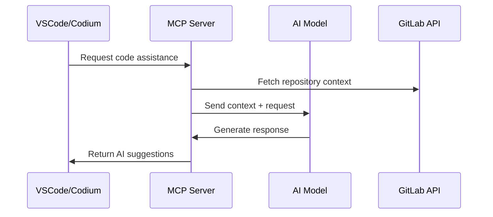
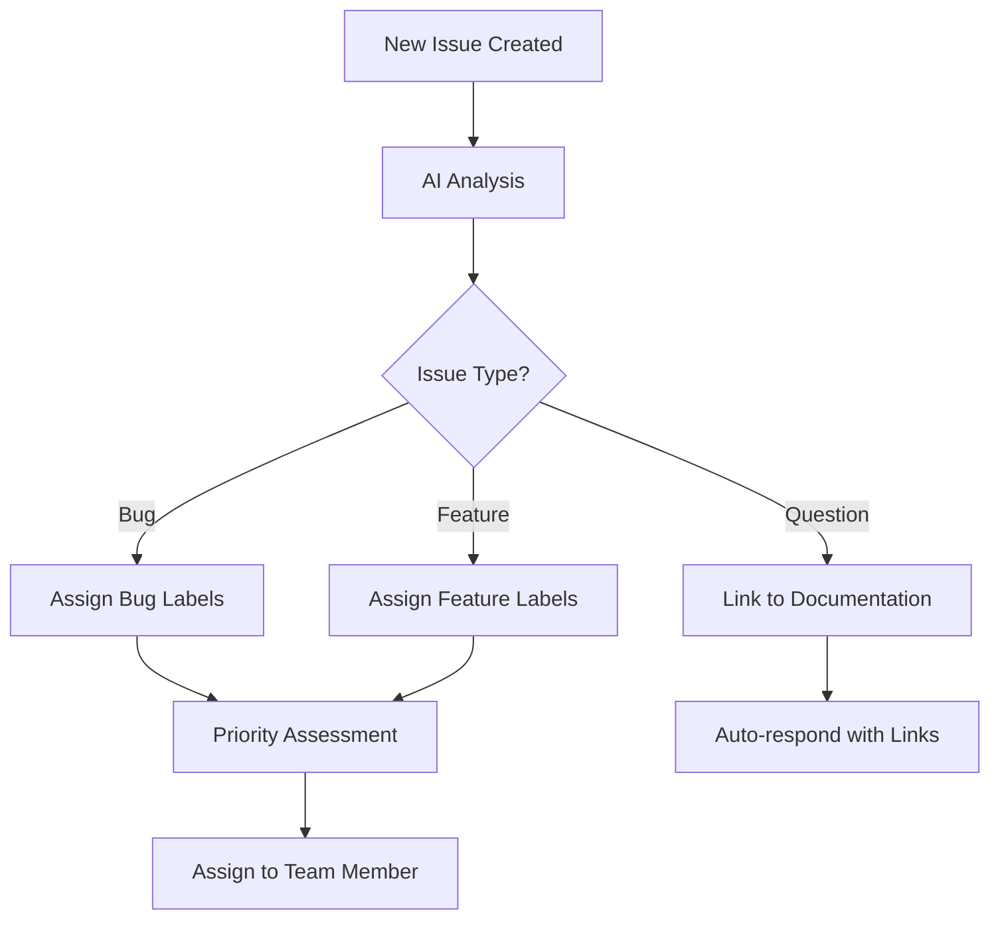

# Use Cases

## 🎯 Overview

This document outlines the various use cases for the AI-enhanced GitLab development environment, showcasing how developers can leverage AI capabilities integrated with GitLab workflows.

## 🚀 Primary Use Cases

### 1. MCP Server Integration with IDE

Configure the Model Context Protocol (MCP) server within your IDE for seamless AI assistance.

#### Benefits
- Real-time AI code suggestions
- Contextual code completion
- Intelligent refactoring recommendations
- Automated documentation generation

#### Implementation


#### Configuration Steps
1. Install MCP client extension in your IDE
2. Configure MCP server endpoint (`http://localhost:3000`)
3. Set up GitLab API credentials
4. Enable AI model integration (OpenAI/Anthropic)

### 2. Docker Compose Development Environment

Create a complete containerized development environment using Docker Compose.

#### Components
- **GitLab CE**: Self-hosted GitLab instance
- **MCP Server**: AI integration service
- **PostgreSQL**: Database backend
- **Redis**: Caching layer

#### Environment Variables
```bash
# Core Services
GITLAB_URL=http://localhost:8080
GITLAB_TOKEN=your-gitlab-token
MCP_SERVER_PORT=3000

# AI Integration
OPENAI_API_KEY=your-openai-key
ANTHROPIC_API_KEY=your-anthropic-key

# Database
POSTGRES_DB=gitlabhq_production
POSTGRES_USER=gitlab
POSTGRES_PASSWORD=secure-password
```

#### Deployment Commands
```bash
# Start all services
docker-compose up -d

# Check service health
docker-compose ps
docker-compose logs -f

# Scale services if needed
docker-compose up -d --scale mcp-server=2
```

## 🔧 Secondary Use Cases

### 3. Automated Code Review

Leverage AI to enhance code review processes within GitLab merge requests.

#### Features
- **Code Quality Analysis**: Automated detection of code smells and anti-patterns
- **Security Vulnerability Scanning**: AI-powered security analysis
- **Performance Optimization**: Suggestions for performance improvements
- **Documentation Compliance**: Ensure code is properly documented

#### Implementation
```yaml
# .gitlab-ci.yml
ai_code_review:
  stage: review
  script:
    - curl -X POST http://mcp-server:3000/analyze \
        -H "Content-Type: application/json" \
        -d '{"merge_request_id": "$CI_MERGE_REQUEST_ID"}'
  only:
    - merge_requests
```

### 4. Intelligent Issue Management

Use AI to categorize, prioritize, and suggest solutions for GitLab issues.

#### Capabilities
- **Auto-labeling**: Automatically categorize issues based on content
- **Priority Assignment**: AI-driven priority assessment
- **Solution Suggestions**: Recommend potential solutions or similar resolved issues
- **Duplicate Detection**: Identify and link duplicate issues

#### Workflow


### 5. CI/CD Pipeline Optimization

Optimize GitLab CI/CD pipelines using AI recommendations.

#### Optimization Areas
- **Build Time Reduction**: Suggest parallel execution strategies
- **Resource Optimization**: Recommend optimal runner configurations
- **Test Suite Enhancement**: Identify redundant or missing tests
- **Deployment Strategy**: Suggest blue-green or canary deployment patterns

#### Example Pipeline Enhancement
```yaml
# Before AI optimization
stages:
  - build
  - test
  - deploy

build:
  stage: build
  script:
    - make build

test:
  stage: test
  script:
    - make test
  needs: [build]

# After AI optimization
stages:
  - build_and_test
  - deploy

build_and_test:
  stage: build_and_test
  parallel:
    matrix:
      - BUILD_TYPE: [unit, integration, e2e]
  script:
    - make build-$BUILD_TYPE
    - make test-$BUILD_TYPE
```

### 6. Documentation Generation

Automatically generate and maintain project documentation.

#### Generated Content
- **API Documentation**: Auto-generate from code comments
- **README Updates**: Keep README files synchronized with code changes
- **Changelog Creation**: Generate changelogs from commit messages
- **Architecture Diagrams**: Create visual representations of system architecture

#### Integration Example
```bash
# Post-commit hook
#!/bin/bash
curl -X POST http://mcp-server:3000/generate-docs \
  -H "Authorization: Bearer $GITLAB_TOKEN" \
  -d '{
    "project_id": "'$CI_PROJECT_ID'",
    "commit_sha": "'$CI_COMMIT_SHA'",
    "doc_types": ["api", "readme", "changelog"]
  }'
```

## 🎨 Advanced Use Cases

### 7. Code Migration Assistant

AI-powered assistance for migrating code between different technologies or frameworks.

#### Migration Types
- **Language Migration**: Convert code between programming languages
- **Framework Upgrades**: Assist with framework version upgrades
- **Architecture Refactoring**: Guide microservices decomposition
- **Database Migration**: Help with database schema changes

### 8. Performance Monitoring Integration

Integrate AI analysis with GitLab's monitoring capabilities.

#### Features
- **Anomaly Detection**: Identify unusual performance patterns
- **Capacity Planning**: Predict resource requirements
- **Error Analysis**: Correlate errors with code changes
- **User Experience Optimization**: Suggest UX improvements based on metrics

### 9. Security Compliance Automation

Ensure security compliance through AI-driven analysis.

#### Compliance Areas
- **OWASP Top 10**: Automated scanning for common vulnerabilities
- **License Compliance**: Check dependency licenses
- **Data Privacy**: Ensure GDPR/CCPA compliance
- **Access Control**: Review and suggest permission improvements

## 📊 Metrics and Success Indicators

### Development Velocity
- Reduction in code review time
- Faster feature development cycles
- Decreased bug resolution time
- Improved code quality scores

### Team Productivity
- Increased developer satisfaction
- Reduced context switching
- Enhanced collaboration efficiency
- Better knowledge sharing

### Quality Improvements
- Lower defect rates
- Improved test coverage
- Better documentation quality
- Enhanced security posture

## 🛠️ Implementation Roadmap

### Phase 1: Basic Integration (Weeks 1-2)
- [ ] Set up Docker Compose environment
- [ ] Configure MCP server
- [ ] Integrate with IDE
- [ ] Basic AI code assistance

### Phase 2: GitLab Workflow Enhancement (Weeks 3-4)
- [ ] Implement automated code review
- [ ] Set up intelligent issue management
- [ ] Configure CI/CD optimizations
- [ ] Enable documentation generation

### Phase 3: Advanced Features (Weeks 5-8)
- [ ] Deploy performance monitoring
- [ ] Implement security compliance
- [ ] Add migration assistance
- [ ] Enable advanced analytics

## 🔗 Related Documentation

- [Prerequisites](prerequisites.md): Required tools and setup
- [Setup Guide](setup.md): Step-by-step installation
- [Docker Compose](docker-compose.md): Container configuration
- [IDE Configuration](ide-config.md): IDE setup instructions
- [Contributing](contributing.md): How to contribute to the project
